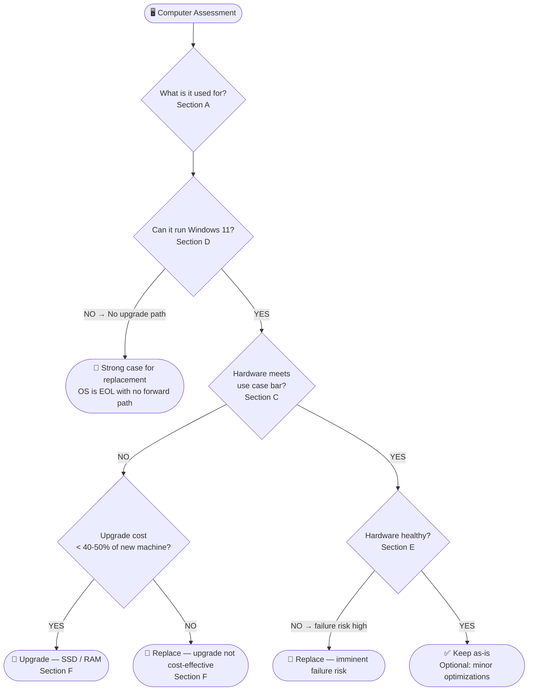

# Computer Assessment — Repair, Upgrade, or Replace?

<div style="display:flex;gap:8px;flex-wrap:wrap;margin-bottom:16px">
<span style="background:#8e44ad;color:white;padding:3px 12px;border-radius:12px;font-size:0.85em;font-weight:bold">CONSULTATION</span>
<span style="background:#f39c12;color:white;padding:3px 12px;border-radius:12px;font-size:0.85em;font-weight:bold">IN PROGRESS — 2026-03-27</span>
<span style="background:#3498db;color:white;padding:3px 12px;border-radius:12px;font-size:0.85em;font-weight:bold">Windows · Any Hardware</span>
</div>

---

## ⚡ Decision Tree — Start Here



---

## 🔵 A — Purpose & Use Case

> [!tip] This is the most important section. The use case determines every other decision. Ask this first.

### A1 — Ask the Client

<div style="display:grid;grid-template-columns:1fr 1fr;gap:10px;margin:12px 0">

<div style="border:1px solid #3498db;border-radius:8px;padding:12px">
<b>📋 What do you do on this computer?</b><br>
• Email and web browsing only?<br>
• Microsoft Office / Google Docs?<br>
• Video calls (Teams, Zoom)?<br>
• Photo or video editing?<br>
• Accounting or business software?<br>
• Gaming?<br>
• Programming / development?
</div>

<div style="border:1px solid #3498db;border-radius:8px;padding:12px">
<b>🕐 How do you use it?</b><br>
• How many hours per day?<br>
• Do you have multiple windows/tabs open at once?<br>
• Do you work from home or in an office?<br>
• Is speed or reliability more important?<br>
• Do you use external devices? (printer, scanner, drawing tablet)
</div>

<div style="border:1px solid #f39c12;border-radius:8px;padding:12px">
<b>⚠️ Current complaints</b><br>
• Is it slow? When specifically?<br>
• Does it freeze or crash?<br>
• How long have you had it?<br>
• Has it been repaired before?<br>
• Any data you can't lose?
</div>

<div style="border:1px solid #8e44ad;border-radius:8px;padding:12px">
<b>💰 Budget context</b><br>
• Is there a budget for repair or replacement?<br>
• Is this a personal or business machine?<br>
• Does the business have IT support or a replacement cycle?<br>
• Would downtime cost money?
</div>

</div>

---

### A2 — Use Case Capability Bar

Match the client's answers to the minimum hardware required:

| Use Case | Min CPU | Min RAM | Storage | GPU |
|---|---|---|---|---|
| Email · web · Office | Core i3 (6th gen+) / Ryzen 3 | 8 GB | 128 GB SSD | Integrated |
| Video calls + multitasking | Core i5 (6th gen+) / Ryzen 5 | 16 GB | 256 GB SSD | Integrated |
| Photo editing (Lightroom) | Core i5 (8th gen+) / Ryzen 5 | 16 GB | 512 GB SSD | Integrated OK |
| Video editing (Premiere, DaVinci) | Core i7 (8th gen+) / Ryzen 7 | 32 GB | 1 TB SSD | Dedicated GPU |
| Accounting software (QuickBooks etc.) | Core i5 (6th gen+) | 8–16 GB | 256 GB SSD | Integrated |
| Gaming | Core i5 (10th gen+) / Ryzen 5 5000 | 16 GB | 512 GB SSD | Dedicated GPU required |
| Development / coding | Core i5 (8th gen+) / Ryzen 5 | 16 GB | 512 GB SSD | Integrated OK |

> [!note] These are comfortable minimums — not absolutes. A machine slightly below bar may still be acceptable depending on client expectations and budget.

---

## 🔵 B — Physical Inspection

> [!tip] Do this before running any software. Physical condition tells you the failure risk.

<div style="display:grid;grid-template-columns:1fr 1fr;gap:10px;margin:12px 0">

<div style="border:1px solid #e74c3c;border-radius:8px;padding:12px">
<b>🌡️ Thermals</b><br>
• Heavy dust on vents or fan grills?<br>
• Fan making grinding or rattling noise?<br>
• Hot air exhaust within 60s of boot?<br>
• Laptop bottom extremely hot at idle?
</div>

<div style="border:1px solid #e74c3c;border-radius:8px;padding:12px">
<b>💾 Storage signs</b><br>
• Clicking or grinding sounds from HDD area?<br>
• Very slow boot or program load?<br>
• Files taking long to open or save?<br>
• Unexpected freezes during read/write?
</div>

<div style="border:1px solid #f39c12;border-radius:8px;padding:12px">
<b>🖥️ Display & chassis (laptop)</b><br>
• Screen flickering, dead pixels, or lines?<br>
• Hinge cracked or loose?<br>
• Keyboard keys missing or sticking?<br>
• Battery swollen (lifting the trackpad or back)?<br>
• Charging port loose or intermittent?
</div>

<div style="border:1px solid #f39c12;border-radius:8px;padding:12px">
<b>🔌 Ports & peripherals</b><br>
• USB ports working?<br>
• Video output working?<br>
• Any ports physically damaged?<br>
• All needed ports present for client's devices?
</div>

</div>

> [!danger] Swollen battery, clicking drive, or heavy capacitor damage = immediate failure risk. Replacement recommendation regardless of specs.

---

## 🔵 C — Hardware Specs

> [!tip] Run these commands first — they take 60 seconds and give you everything

### C1 — Quick Spec Dump (CMD or PowerShell as Admin)

```powershell
# Full system summary — paste into notes
Get-ComputerInfo | Select-Object CsName, CsProcessors, CsTotalPhysicalMemory, OsName, OsVersion, BiosVersion | Format-List
```

```cmd
:: CPU
wmic cpu get name, numberofcores, maxclockspeed

:: RAM (each stick)
wmic memorychip get capacity, speed, manufacturer

:: Storage
wmic diskdrive get model, size, status, mediatype

:: GPU
wmic path win32_videocontroller get name, adapterram

:: System age / serial (for warranty lookup)
wmic bios get serialnumber, releasedate
```

**Or open:** `msinfo32` → gives all of the above in one view. Screenshot or photo it.

---

### C2 — Interpret the Specs

<details>
<summary>CPU generation quick reference</summary>

| Intel Brand | Generation | Year | Windows 11? | Notes |
|---|---|---|---|---|
| Core i_-2xxx | 2nd gen (Sandy Bridge) | 2011 | ❌ No | 15 yr old machine territory |
| Core i_-3xxx | 3rd gen (Ivy Bridge) | 2012 | ❌ No | |
| Core i_-4xxx | 4th gen (Haswell) | 2013–2014 | ❌ No | |
| Core i_-5xxx | 5th gen (Broadwell) | 2015 | ❌ No | |
| Core i_-6xxx | 6th gen (Skylake) | 2015–2016 | ❌ No | Still capable for basic tasks |
| Core i_-7xxx | 7th gen (Kaby Lake) | 2017 | ❌ No | Borderline — TPM may be present |
| Core i_-8xxx | 8th gen (Coffee Lake) | 2018 | ✅ Yes | Sweet spot for upgrades |
| Core i_-10xxx | 10th gen | 2020 | ✅ Yes | |
| Core i_-12xxx+ | 12th gen+ | 2022+ | ✅ Yes | Modern |

| AMD Brand | Series | Windows 11? |
|---|---|---|
| Ryzen 1000 | 2017 | ❌ No |
| Ryzen 2000 | 2018 | ✅ Yes |
| Ryzen 3000+ | 2019+ | ✅ Yes |

</details>

<details>
<summary>RAM assessment</summary>

| Installed RAM | Assessment |
|---|---|
| 4 GB | Insufficient for any modern Windows use. Upgrade or replace. |
| 8 GB | Minimum for basic use. Acceptable for email/Office. Borderline for multitasking. |
| 16 GB | Good for most use cases including video calls and light editing. |
| 32 GB+ | Strong — suitable for creative work and development. |

**Check if RAM is upgradeable:**
- Desktop: almost always yes
- Laptop: check if slots are free or if RAM is soldered (common on thin laptops post-2018)

```cmd
wmic memorychip get capacity, speed, manufacturer
```
Count the results — each line is one stick. If 2 sticks at max capacity, no room to upgrade without replacing.

</details>

<details>
<summary>Storage assessment</summary>

**Type matters more than size:**

| Storage Type | Speed | Assessment |
|---|---|---|
| HDD (spinning) | Slow | Major bottleneck. SSD swap is the single highest-impact upgrade. |
| SATA SSD | Fast | Good. No action needed unless low capacity. |
| NVMe SSD | Very fast | Excellent. No action needed. |

```cmd
wmic diskdrive get model, mediatype, size, status
```
- MediaType `Fixed hard disk` = HDD
- MediaType `Solid state drive` or model containing SSD/NVMe = SSD

**Check drive health:**
```cmd
wmic diskdrive get status, model
```
`Pred Fail` = failing drive. Replace immediately regardless of other specs.

</details>

---

## 🔵 D — OS & Support Status

> [!danger] An unsupported OS is a non-negotiable issue for any client machine. Address this before anything else.

### D1 — Check Current Windows Version

```cmd
winver
```

| Version | Support Status | Action |
|---|---|---|
| Windows 7 / 8 / 8.1 | ❌ EOL | Replace or Linux |
| Windows 10 (any) | ❌ EOL since Oct 2025 | Upgrade to Win 11 or replace |
| Windows 11 | ✅ Supported | Good |

---

### D2 — Windows 11 Compatibility Check

```powershell
# Check TPM version (needs 2.0 for Win 11)
Get-WmiObject -Namespace "root\cimv2\security\microsofttpm" -Class Win32_Tpm | Select-Object -ExpandProperty SpecVersion
```

**Or:** Download and run the official **PC Health Check** tool from Microsoft → gives a pass/fail with specific reasons.

| Requirement | Minimum | Check |
|---|---|---|
| CPU | 8th gen Intel / Ryzen 2000 | See [[#C2 — Interpret the Specs]] |
| RAM | 4 GB | `wmic memorychip get capacity` |
| Storage | 64 GB free | Disk Management |
| TPM | Version 2.0 | Command above |
| Secure Boot | Capable | BIOS → Security |
| Display | 720p, 9" | Visual check |

> [!warning] TPM 2.0 can sometimes be enabled in BIOS even if the tool says it's missing. Check BIOS → Security → TPM or PTT (Intel) / fTPM (AMD) before declaring a machine incompatible.

---

### D3 — If Windows 11 Is Not Possible

| Option | When to Use | Consideration |
|---|---|---|
| Force Win 11 install (bypass TPM) | Never for client machines | Unsupported, no Windows Update, security risk |
| Stay on Windows 10 + ESU | Business with budget, short term only | Extended Security Updates cost ~$61/device/yr |
| Switch to Linux (Ubuntu, Mint) | Basic use cases, client is open to it | Free, lightweight, runs on old hardware |
| Replace the machine | Hardware too old, no upgrade path | Right call when CPU is pre-8th gen |

---

## 🔵 E — Health & Performance Check

### E1 — Drive Health (SMART)

```cmd
wmic diskdrive get status, model
```
`Pred Fail` = imminent failure. Do not invest in this machine — back up data immediately.

For deeper SMART data: boot **Medicat USB** → Hiren's PE → **CrystalDiskInfo**

| SMART Attribute | Danger |
|---|---|
| Reallocated Sector Count > 0 | Warning · > 50 = replace |
| Current Pending Sector > 0 | Active read failure |
| Uncorrectable Sector Count > 0 | Drive is failing |
| Power-On Hours HDD > 30,000 | Aging |

---

### E2 — Thermals

```cmd
:: Quick CPU temp (CMD — some systems)
wmic /namespace:\\root\wmi PATH MSAcpi_ThermalZoneTemperature get CurrentTemperature
```
*(Divide by 10, subtract 273 → °C. Above 80°C at idle = thermal problem)*

| Temp at Idle | Status |
|---|---|
| 30–50°C | ✅ Healthy |
| 60–75°C | ⚠️ Warm — check dust / paste |
| 80°C+ | 🔴 Thermal issue — clean or repaste before any other assessment |

> [!note] A thermally throttling machine will appear slower than it is. Clean the heatsink and retest performance before making a replacement recommendation based on speed.

---

### E3 — RAM Health

```cmd
mdsched.exe
```
Restart now and check for problems. Runs before Windows loads. Any errors = bad RAM.

---

### E4 — Quick Performance Feel Test

<details>
<summary>Subjective benchmarks (no tools needed)</summary>

Time these manually with a stopwatch:

| Test | Acceptable | Poor |
|---|---|---|
| Cold boot to desktop | < 30s (SSD) / < 90s (HDD) | > 2 min |
| Open Microsoft Word / Excel | < 5s | > 15s |
| Open Chrome + 5 tabs | < 10s | > 30s |
| Copy a 1 GB file locally | < 30s (SSD) | > 3 min (HDD sign) |
| CPU usage at idle (Task Manager) | < 10% | > 40% persistent |

High idle CPU = background process issue (malware, Windows Update, startup bloat) — not necessarily a hardware problem.

</details>

---

## 🔵 F — Cost Analysis

> [!tip] The 40-50% rule: if upgrade cost exceeds 40-50% of a comparable new machine, recommend replacement.

### F1 — Upgrade Cost Estimate

| Upgrade | Typical Cost | Impact |
|---|---|---|
| HDD → SATA SSD (500 GB) | $40–70 | ⭐⭐⭐⭐⭐ Highest single impact |
| Add RAM (8 GB stick) | $20–40 | ⭐⭐⭐⭐ High if under 8 GB |
| Clean thermals + repaste | $0–20 (materials) | ⭐⭐⭐ High if throttling |
| New battery (laptop) | $30–80 | ⭐⭐⭐ Essential for portable use |
| Windows 11 license (if needed) | ~$140 | ⭐⭐ Only if hardware qualifies |
| CPU + motherboard upgrade | $150–400+ | ⭐ Rarely cost-effective — buy new |

---

### F2 — Replacement Reference Prices

| Budget | What You Get |
|---|---|
| $200–350 | Refurbished business PC (Dell OptiPlex, HP EliteDesk) — Core i5 8th gen, 8 GB RAM, SSD. Solid for basic use. |
| $350–550 | Refurbished or entry new — Core i5 10th/11th gen, 16 GB RAM, SSD. Good for most professionals. |
| $550–900 | New mid-range — Core i5/i7 12th gen+, 16 GB RAM, fast SSD. Comfortable for demanding tasks. |
| $900+ | New high-end or business — Core i7/i9, 32 GB, NVMe. Creative / dev work. |

---

### F3 — Decision Matrix

<div style="display:grid;grid-template-columns:1fr 1fr 1fr;gap:10px;margin:12px 0">

<div style="border:2px solid #2ecc71;border-radius:8px;padding:12px">
<b>✅ Keep / Minor Upgrade</b><br><br>
• Win 11 compatible<br>
• Has SSD already<br>
• 8+ GB RAM<br>
• Healthy drive + thermals<br>
• Meets use case bar<br>
• Upgrade cost < $100<br><br>
<em>Action: clean thermals, optimize startup, done</em>
</div>

<div style="border:2px solid #f39c12;border-radius:8px;padding:12px">
<b>🔧 Upgrade</b><br><br>
• Win 11 compatible (8th gen+)<br>
• Has HDD → swap to SSD<br>
• Low RAM → add a stick<br>
• Hardware otherwise healthy<br>
• Upgrade cost < 40% of new<br><br>
<em>Action: SSD + RAM. Expect 3–5 more years</em>
</div>

<div style="border:2px solid #e74c3c;border-radius:8px;padding:12px">
<b>🔴 Replace</b><br><br>
• Pre-8th gen Intel / Ryzen 1000<br>
• No Win 11 path<br>
• Failing drive or bad thermals<br>
• Upgrade cost > 50% of new<br>
• Physical damage (swollen battery, broken board)<br><br>
<em>Action: back up data, recommend budget above</em>
</div>

</div>

---

## 📋 Assessment Notes Template

*Fill this in on-site:*

```
Date:
Client name / machine:

--- USE CASE ---
Primary use:
Hours/day:
Complaints:
Budget range:

--- HARDWARE ---
CPU:                          Generation:
RAM installed:                Slots free:
Storage type (HDD/SSD):       Size:        Health (SMART status):
GPU:
Serial number:                Approx. age:

--- OS ---
Current Windows version:
Windows 11 compatible? Y / N
TPM 2.0 present? Y / N

--- PHYSICAL ---
Dust / thermals: OK / Poor
Drive sounds: OK / Clicking
Battery (laptop): OK / Swollen / Dead
Physical damage: None / [describe]

--- PERFORMANCE ---
Boot time:          sec
Idle CPU %:
Idle temp:          °C

--- VERDICT ---
[ ] Keep as-is
[ ] Upgrade — items: ________________  Est. cost: $
[ ] Replace — recommended budget: $

Notes:
```

---

## 📋 Quick Commands Reference

```powershell
# Full system info
msinfo32

# Windows version
winver

# CPU info
wmic cpu get name, numberofcores, maxclockspeed

# RAM sticks
wmic memorychip get capacity, speed, manufacturer

# Drive type and health
wmic diskdrive get model, mediatype, size, status

# GPU
wmic path win32_videocontroller get name, adapterram

# Serial number + BIOS date (machine age)
wmic bios get serialnumber, releasedate

# TPM version (Windows 11 check)
Get-WmiObject -Namespace "root\cimv2\security\microsofttpm" -Class Win32_Tpm | Select-Object -ExpandProperty SpecVersion

# Idle CPU usage snapshot
(Get-Counter '\Processor(_Total)\% Processor Time').CounterSamples.CookedValue

# RAM memory diagnostic
mdsched.exe

# Drive SMART quick check
wmic diskdrive get status, model
```
