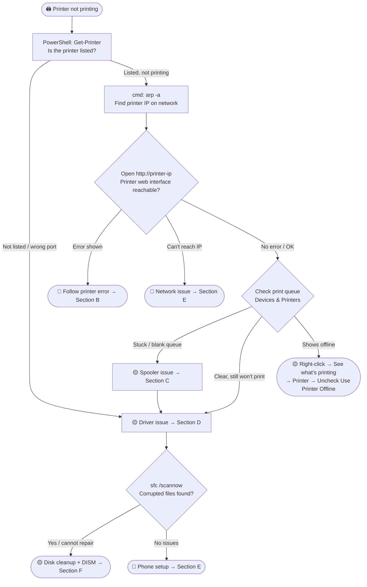

# Printer — Not Printing

<div style="display:flex;gap:8px;flex-wrap:wrap;margin-bottom:16px">
<span style="background:#e74c3c;color:white;padding:3px 12px;border-radius:12px;font-size:0.85em;font-weight:bold">HIGH SEVERITY</span>
<span style="background:#2ecc71;color:white;padding:3px 12px;border-radius:12px;font-size:0.85em;font-weight:bold">RESOLVED — 2026-03-26</span>
<span style="background:#3498db;color:white;padding:3px 12px;border-radius:12px;font-size:0.85em;font-weight:bold">Brother HL-L2400DW · Canon MG3660 · Windows</span>
<span style="background:#7f8c8d;color:white;padding:3px 12px;border-radius:12px;font-size:0.85em;font-weight:bold">No internet required for most steps</span>
</div>

---

## ⚡ Fault Tree — Start Here



---

## ✅ Resolved Case — 2026-03-26

<div style="border-left:4px solid #2ecc71;padding:14px 16px;border-radius:0 8px 8px 0;margin:4px 0">

**Model:** Brother HL-L2400DW
**Machine:** Intel Core i3 · Windows · Poor internet (~5 Mbps down)
**Original request:** Configure printer on client's phone

**Root cause:** Corrupted print spooler — queue UI was blank/frozen, Windows Event Viewer showed nothing useful

**Path taken:**
1. Attempted to print → error popup blank, queue inaccessible
2. Uninstalled all Brother software and drivers
3. Spooler flush via PowerShell (Stop-Service → clear spool folder → Start-Service)
4. SFC + DISM run *(not recommended without evidence of system corruption — cost ~30 min on slow connection)*
5. Spooler still stubborn → killed `spoolsv.exe` via Task Manager
6. Full spooler reset via `sc.exe` (disable → stop → clear folder → auto → start)
7. Restarted → reinstalled Brother drivers → machine printing

**Missed:** `arp -a` to find printer IP — would have enabled Brother web interface access and phone setup from the start

**Key insight:** When Windows logs are silent and the queue is blank, go to the **printer's own web interface** at its IP. That's where the real error log lives, independent of Windows.

</div>

---

## ✅ Resolved Case — 2026-03-27

<div style="border-left:4px solid #2ecc71;padding:14px 16px;border-radius:0 8px 8px 0;margin:4px 0">

**Model:** Canon MG3660
**Machine:** Windows · Limited disk space
**Original request:** Printer not printing, drivers missing

**Root cause:** Missing printer drivers + corrupted Windows system files + Temp folder full (blocked repair tools from running).

**Path taken:**
1. `Get-Printer` → printer not listed → confirmed driver/installation missing
2. `arp -a` → printer IP not found on network → confirmed no communication with PC
3. Removed printer from Devices & Printers completely
4. `sfc /scannow` → found corrupted files but could not repair them
5. Temp folder blocked DISM → fixed permissions: `icacls "C:\Users\[User]\AppData\Local\Temp" /grant *S-1-1-0:F /T`
6. Cleared Temp: `del /q /f /s "%temp%\*"` → then `cleanmgr /sageset:1` + `cleanmgr /sagerun:1`
7. `DISM /Online /Cleanup-Image /RestoreHealth` → Windows image repaired
8. Downloaded and installed full Canon driver package from canon.com → machine printing

**Time to resolve:** ~1 hour

**Key insight:** When `sfc /scannow` says it cannot repair files, check disk space *before* running DISM — a full Temp folder silently blocks the repair. Clear Temp and fix permissions first.

</div>

---

## 🔵 A — First 5 Minutes

> [!tip] Do these before touching any software or drivers

<div style="display:grid;grid-template-columns:1fr 1fr;gap:10px;margin:12px 0">

<div style="border:1px solid #3498db;border-radius:8px;padding:12px">
<b>🖨️ Physical check</b><br>
• Power light on and steady?<br>
• No flashing error lights or codes on display?<br>
• Paper loaded correctly, no jam?<br>
• USB or network cable seated firmly?<br>
• Try a manual test print (hold Go/Test button on printer)
</div>

<div style="border:1px solid #3498db;border-radius:8px;padding:12px">
<b>🖥️ Windows side</b><br>
• Run in PowerShell: <code>Get-Printer | Select-Object Name, Description, PrintHostAddress</code><br>
• Is the printer listed? Is the IP/port correct?<br>
• Is it set as Default Printer?<br>
• Is it showing as Offline? → right-click → See what's printing → Printer → uncheck Use Printer Offline<br>
• Any jobs stuck in the queue?
</div>

<div style="border:1px solid #f39c12;border-radius:8px;padding:12px">
<b>🌐 Network check</b><br>
• Is the printer on the same Wi-Fi as the PC?<br>
• Run <code>arp -a</code> in CMD → find printer IP<br>
• Open <code>http://[printer-ip]</code> in browser<br>
• Can you ping it? <code>ping [printer-ip]</code>
</div>

<div style="border:1px solid #e74c3c;border-radius:8px;padding:12px">
<b>⚠️ Queue / spooler warning signs</b><br>
• Queue popup is blank or frozen → spooler issue<br>
• Jobs stuck as "Deleting" → spooler issue<br>
• "Printer not activated" error → driver issue<br>
• Printer shows but won't respond → network or driver
</div>

</div>

---

## 🔵 B — Get Diagnostic Information

> [!tip] The Brother web interface is the most reliable source of truth — use it before touching Windows at all

### B1 — Printer Web Interface (Most Valuable Step)

Every modern network printer has a built-in web interface accessible at its IP address — this is the most reliable source of truth, independent of Windows.

```
1. Run in CMD:   arp -a
2. Find the printer MAC in the list — common prefixes by brand:
     Brother:  00:1B:A9 / 00:80:77 / 04:6C:59 / 30:05:5C
     Canon:    00:00:85 / 00:1E:8F / 04:DA:D2 / 2C:9E:FC
3. Open browser → http://[printer-ip]
4. Look for error logs and network status (menu paths vary by brand):
```

| Brand | Error Log Path | Network Status Path |
|---|---|---|
| Brother | General Setup → Maintenance → Error Log | Network → WLAN |
| Canon | Maintenance → Error Details / Status | Network → Wireless LAN |

> [!warning] If you can't reach the web interface, the printer is either off the network or has a different IP than expected. Go to [[#E — Network & Phone Setup]]

**What to look for in any brand's web interface:**

| Section | What It Tells You |
|---|---|
| Network / WLAN | IP address, signal strength, connection status |
| Error Log / Maintenance | Printer-side errors independent of Windows |
| Job History | Last jobs sent and their status |
| Administrator → Reset | Factory reset option if all else fails |

---

### B2 — Windows Logs (When Accessible)

<details>
<summary>Event Viewer — spooler errors</summary>

`Win+R` → `eventvwr.msc` → Windows Logs → System → Filter: Error + Critical
Look for source: `Print Spooler` or `Spooler`

**If queue is blank and Event Viewer shows nothing** — the spooler is likely in a state where it cannot log. Go directly to [[#C — Spooler Reset]]. Do not run SFC or DISM unless you have evidence of system file corruption.

</details>

<details>
<summary>Check spool folder for ghost jobs</summary>

```powershell
Get-ChildItem "$env:SystemRoot\System32\spool\PRINTERS\"
```
If `.SHD` or `.SPL` files exist → spooler is stuck with a ghost job. Clearing this folder is the fix.

</details>

<details>
<summary>Check spooler dependencies</summary>

```cmd
sc.exe qc Spooler
```
A failing dependency (like Remote Procedure Call) silently kills the spooler with no visible error.

</details>

<details>
<summary>Enable verbose spooler logging (optional)</summary>

```cmd
reg add "HKLM\SYSTEM\CurrentControlSet\Services\Spooler" /v "LogLevel" /t REG_DWORD /d 3 /f
```
Restart spooler. Logs appear in Event Viewer under Applications and Services Logs → Microsoft → Windows → PrintService.

</details>

---

## 🟡 C — Spooler Reset

> [!warning] Blank queue or frozen popup = spooler is likely corrupt. This is the fix. Do it once, do it right.

### Full Spooler Reset (sc.exe method — most reliable)

```cmd
sc.exe config Spooler start= disabled
sc.exe stop Spooler
```

Wait 5 seconds, then clear the spool folder:

```powershell
Remove-Item -Path "$env:SystemRoot\System32\spool\PRINTERS\*" -Force -Recurse
```

Re-enable and start:

```cmd
sc.exe config Spooler start= auto
sc.exe start Spooler
```

Verify:

```powershell
Get-Service Spooler
```
Status should show `Running`.

> [!note] If `sc.exe stop` doesn't terminate the process, open Task Manager → Details tab → find `spoolsv.exe` → End Task. Then re-run the clear and start steps. Do not run both the PowerShell Stop-Service method AND the sc.exe method — pick one.

> [!question] Spooler running but printer still won't print? → [[#D — Driver Reinstall]]

---

## 🟡 D — Driver Reinstall

> [!tip] Uninstall completely before reinstalling — Brother leaves registry entries that cause silent failures on partial installs

### D1 — Full Brother Uninstall

<details>
<summary>Steps</summary>

1. Control Panel → Programs & Features → uninstall **all** Brother entries (software, drivers, scanner, status monitor)
2. Open Device Manager → View → Show hidden devices → find any remaining Brother devices → Uninstall (check "Delete the driver software")
3. Clear spool folder again after uninstall:
```powershell
sc.exe stop Spooler
Remove-Item -Path "$env:SystemRoot\System32\spool\PRINTERS\*" -Force -Recurse
sc.exe start Spooler
```
4. Restart before reinstalling

</details>

---

### D2 — Reinstall Driver

<details>
<summary>Steps</summary>

**Option A — Brother installer (full package):**
- Download from support.brother.com → search model → select OS → download Full Driver & Software Package
- Run installer → choose **Wireless Network Connection** if on Wi-Fi
- When asked for IP: use the IP found via `arp -a` or the Brother web interface

**Option B — Windows built-in driver (faster on slow internet):**
- Devices & Printers → Add a printer → The printer that I want isn't listed
- Add a local printer → Create a new port → Standard TCP/IP Port → enter printer IP
- Install driver: Windows Update list or Have Disk (use .INF from downloaded package)

> [!warning] On slow internet, the DISM /Online /Cleanup-Image /RestoreHealth command will download from Windows Update and can take 20–40 min. Only run it if there is confirmed evidence of Windows image corruption — not as a routine step.

</details>

> [!question] Driver installed and spooler running but still won't print? → Print a test page from Devices & Printers → right-click printer → Printer Properties → Print Test Page. If this fails, verify the printer IP hasn't changed.

---

## 🟢 E — Network & Phone Setup

### E1 — Find Printer IP

```cmd
arp -a
```
Look for the Brother MAC address in the list. The associated IP is the printer's address.

**Alternative — from the printer itself:**
- On the printer panel: Menu → Network → WLAN → TCP/IP → IP Address
- Or: hold the Go button for ~4 seconds to print a network configuration page

---

### E2 — Verify Network Connectivity

```cmd
ping [printer-ip]
```
- Replies = printer is reachable
- Timeout = printer is offline, on a different subnet, or Wi-Fi is not connected

**Confirm printer and PC are on the same subnet:**
- PC IP: `ipconfig` → look for IPv4 Address
- Both should share the same first three octets (e.g. 192.168.1.x)

---

### E3 — Phone Setup (Brother iPrint&Scan)

<details>
<summary>Steps</summary>

**Requirements:** Phone and printer must be on the same Wi-Fi network. Have the printer IP ready.

1. Install **Brother iPrint&Scan** from App Store or Google Play
2. Open app → tap the printer icon (top left) → **Select your machine**
3. App will scan the network — if found, tap it
4. If not found automatically: tap **Manual Setup** → enter the printer IP

**AirPrint (iPhone — no app needed):**
- Tap Share → Print in any app → Select Printer → Brother should appear automatically if on same network

**Mopria Print (Android — no app needed):**
- Install Mopria Print Service from Play Store
- Settings → Connected devices → Printing → Mopria → enable → printer should appear

> [!warning] If the phone can't find the printer but the PC can, check if the router has **AP Isolation** or **Client Isolation** enabled — this blocks device-to-device communication on Wi-Fi. Disable it in the router settings.

</details>

---

## 🟡 F — System File Repair & Disk Cleanup

> [!tip] Go here when `sfc /scannow` finds corruption it cannot fix, or when DISM / driver installs silently fail. A full Temp folder is the most common hidden blocker.

### F1 — Clear Temp Files First

<details>
<summary>Steps</summary>

**Fix Temp folder permissions (run CMD as Admin):**
```cmd
icacls "C:\Users\%USERNAME%\AppData\Local\Temp" /grant *S-1-1-0:F /T
```

**Delete Temp files:**
```cmd
del /q /f /s "%temp%\*"
```
Some files will be in use and skip — that is normal.

**Run Disk Cleanup (interactive, choose what to delete):**
```cmd
cleanmgr /sageset:1
cleanmgr /sagerun:1
```
`sageset:1` opens the selection dialog. `sagerun:1` runs the saved profile silently.

> [!note] Always clear Temp before running DISM — a full Temp folder will silently abort the download and repair without a clear error message.

</details>

---

### F2 — Repair Windows System Files

<details>
<summary>Steps</summary>

**Step 1 — SFC (fast, no internet):**
```cmd
sfc /scannow
```
- "Repaired" → reboot and retest
- "Could not fix" → proceed to DISM

**Step 2 — DISM (requires internet or offline source):**
```cmd
DISM /Online /Cleanup-Image /RestoreHealth
```
Downloads replacement files from Windows Update. On slow connections this can take 20–40 min.

**Offline alternative (Windows USB / ISO):**
```cmd
DISM /Online /Cleanup-Image /RestoreHealth /Source:wim:X:\sources\install.wim:1 /LimitAccess
```
Replace `X:` with the USB or mounted ISO drive letter.

**After DISM completes, run SFC again:**
```cmd
sfc /scannow
```

</details>

> [!question] Files repaired? → Reinstall printer drivers → [[#D — Driver Reinstall]]

> [!warning] Do not run DISM as a routine step without evidence of corruption — on slow internet it costs 20–40 min and downloads ~500 MB. Only run it when SFC explicitly reports it cannot fix files.

---

## 📋 Quick Commands

```powershell
# List installed printers with IP/port
Get-Printer | Select-Object Name, Description, PrintHostAddress

# Find printer IP on the network
arp -a

# Ping printer
ping [printer-ip]

# Check spooler status
Get-Service Spooler

# Full spooler reset (run as Admin)
sc.exe config Spooler start= disabled
sc.exe stop Spooler
Remove-Item -Path "$env:SystemRoot\System32\spool\PRINTERS\*" -Force -Recurse
sc.exe config Spooler start= auto
sc.exe start Spooler

# Check for ghost jobs in spool folder
Get-ChildItem "$env:SystemRoot\System32\spool\PRINTERS\"

# Check spooler dependencies
sc.exe qc Spooler

# Fix Temp folder permissions (run CMD as Admin)
icacls "C:\Users\%USERNAME%\AppData\Local\Temp" /grant *S-1-1-0:F /T

# Clear Temp files
del /q /f /s "%temp%\*"

# Disk Cleanup — configure then run profile 1
cleanmgr /sageset:1
cleanmgr /sagerun:1

# Repair Windows system files
sfc /scannow
DISM /Online /Cleanup-Image /RestoreHealth

# Enable verbose spooler logging
reg add "HKLM\SYSTEM\CurrentControlSet\Services\Spooler" /v "LogLevel" /t REG_DWORD /d 3 /f
```

---

## 📋 Brother Error Light Patterns (HL-L2400DW)

| Light Pattern | Meaning | Fix |
|---|---|---|
| Toner LED blinking | Toner low | Replace toner cartridge |
| Drum LED on | Drum unit near end of life | Replace drum or reset drum counter |
| Error LED solid | Paper jam or cover open | Clear jam, close all covers |
| All LEDs blinking | Firmware / hardware error | Power cycle. If persists → factory reset |
| Ready LED off, no lights | Printer asleep / power save | Press Go button to wake |

**To print a network config page:** Hold Go button ~4 seconds → releases automatically → prints IP, MAC, SSID

---

## 🧰 Tools Reference

| Tool | What It Does | Access | Internet? |
|---|---|---|---|
| `Get-Printer` | Lists installed printers and their IP/port assignments | PowerShell | No |
| `arp -a` | Lists all devices on local network with IPs | CMD | No |
| `ping` | Confirm printer is reachable on network | CMD | No |
| Printer web interface | Error log, network status, job log (all brands) | Browser → http://[printer-ip] | No |
| Brother iPrint&Scan | Mobile printing and scanning (Brother) | App Store / Play Store | No (after install) |
| Canon PRINT | Mobile printing and scanning (Canon) | App Store / Play Store | No (after install) |
| `sc.exe` | Service control — most reliable spooler reset | CMD as Admin | No |
| Event Viewer | Windows spooler error logs | `eventvwr.msc` | No |
| Device Manager | Driver status and uninstall | `devmgmt.msc` | No |
| `sfc /scannow` | Repairs corrupted Windows protected files | CMD as Admin | No |
| `DISM /RestoreHealth` | Repairs Windows component store (deeper than SFC) | CMD as Admin | Yes (or offline source) |
| `cleanmgr` | Disk Cleanup — frees Temp and system file space | CMD / Run | No |
| support.brother.com | Official Brother drivers and firmware | Browser | Yes |
| canon.com/support | Official Canon drivers and firmware | Browser | Yes |
