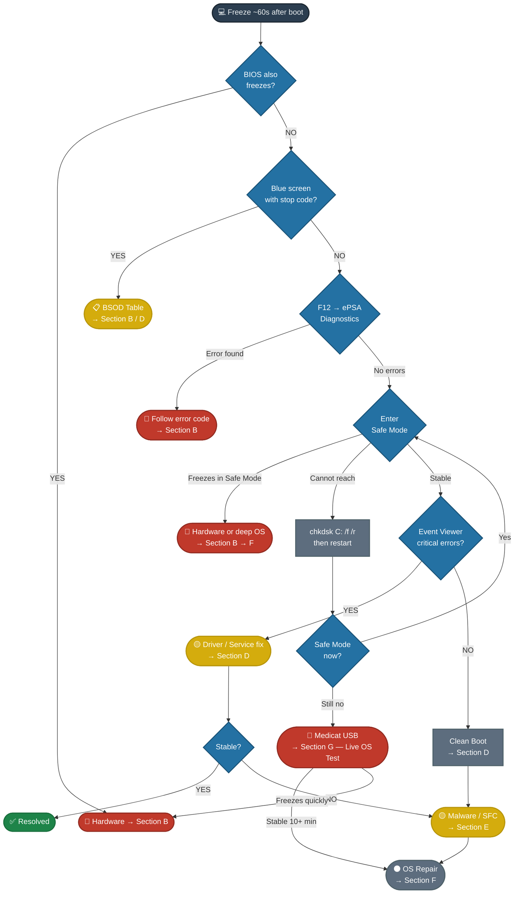
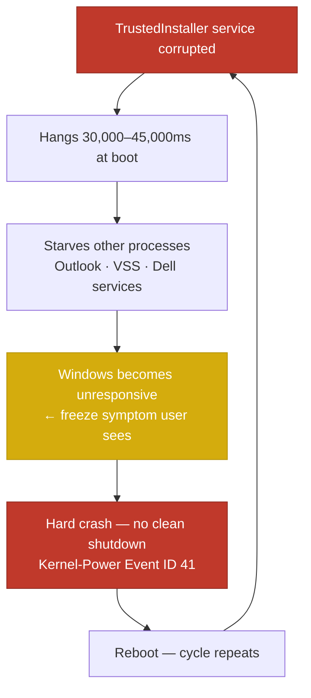

# Dell — Freezes ~60s After Boot

<div style="display:flex;gap:8px;flex-wrap:wrap;margin-bottom:16px">
<span style="background:#e74c3c;color:white;padding:3px 12px;border-radius:12px;font-size:0.85em;font-weight:bold">HIGH SEVERITY</span>
<span style="background:#2ecc71;color:white;padding:3px 12px;border-radius:12px;font-size:0.85em;font-weight:bold">RESOLVED — 2026-03-25</span>
<span style="background:#e74c3c;color:white;padding:3px 12px;border-radius:12px;font-size:0.85em;font-weight:bold">RECURRED — 2026-03-30</span>
<span style="background:#2ecc71;color:white;padding:3px 12px;border-radius:12px;font-size:0.85em;font-weight:bold">RESOLVED — 2026-03-30</span>
<span style="background:#3498db;color:white;padding:3px 12px;border-radius:12px;font-size:0.85em;font-weight:bold">Dell · All Windows</span>
<span style="background:#7f8c8d;color:white;padding:3px 12px;border-radius:12px;font-size:0.85em;font-weight:bold">No internet required</span>
</div>

---

## ⚡ Fault Tree — Start Here



---

## ✅ Resolved Case — 2026-03-25

<div style="border-left:4px solid #2ecc71;padding:14px 16px;border-radius:0 8px 8px 0;margin:4px 0">

**Root cause:** Filesystem corruption masked a corrupted `MicrosoftEdgeElevationService` install — the FS errors prevented Edge's failure from logging until the drive was repaired.

**Path taken:**
1. Safe Mode via Settings → Recovery → Advanced Startup
2. System Restore + Update Rollback → both failed *(FS corruption underneath — software fixes can't stick)*
3. `chkdsk C: /f /r` → reboot → FS errors repaired
4. `MicrosoftEdgeElevationService` critical errors now visible in Event Viewer
5. `edge://settings/help` → updates installed → machine stable

**If it recurs:** Full Edge reinstall instead of repair. Verify in `eventvwr.msc → Application → Source: Wininit` that chkdsk actually fixed errors.

> [!warning] Issue recurred 2026-03-30 — see recurrence analysis and full diagnosis session below. RAM was ruled out by MemTest86. Root cause was corrupted TrustedInstaller / Windows Modules Installer. Resolved by local reinstall same day.

</div>

---

## 🔴 Recurrence Analysis — 2026-03-30

<div style="border-left:4px solid #e74c3c;padding:14px 16px;border-radius:0 8px 8px 0;margin:4px 0">

**Status:** Freeze has returned. Software fix from 2026-03-25 did not hold.
**Presentation:** Machine stuck on blue Windows loading screen → hard freeze before reaching login screen or desktop. Desktop was never reachable — all diagnosis performed from WinRE.

**Initial theory (from peer consultation):** Degrading RAM as the underlying root cause. Bad RAM writes corrupt data to disk, causing recurring NTFS filesystem corruption. `chkdsk` repairs the corruption but cannot fix the RAM — so the cycle repeats.

> [!success] RAM theory disproven — MemTest86 passed with 0 errors on 2026-03-30. Actual root cause: corrupted TrustedInstaller / Windows Modules Installer service. See full diagnosis session below.

**Why this theory is credible:**

| Observation | Software-only explanation | RAM explanation |
|---|---|---|
| Freeze ~60s after boot | Service/driver crashes on load | Bad memory cell hit as Windows pages in more data |
| FS corruption found by chkdsk | Edge/service damaged NTFS structures | Bad RAM wrote garbage to NTFS metadata |
| Fix held for days then returned | Edge got re-corrupted | RAM keeps re-corrupting the FS regardless of software state |
| March 25 fix: chkdsk + Edge update | Resolved both issues | Only masked the symptom — FS repaired but source of corruption untouched |
| ePSA diagnostics passed | — | ePSA RAM test is single-pass basic — misses subtle cell degradation |

**The pattern — fix works, then the same problem comes back — is the defining behavioral signature of a hardware root cause under a software symptom.**

**Action required before any further software fixes:**

1. Check for BSOD stop code this time (see table below)
2. Run `chkdsk` and note whether FS errors are present again — if yes, confirms the corruption cycle
3. **Run MemTest86 via Medicat USB** — full 2+ pass — before touching the OS again

> [!warning] Do not run `chkdsk`, SFC, DISM, or OS repair until MemTest86 is complete. If RAM is bad, any software fix will fail again within days or weeks.

**BSOD stop codes that confirm RAM:**

| Stop Code | Implication |
|---|---|
| `PAGE_FAULT_IN_NONPAGED_AREA` | Strong RAM indicator |
| `WHEA_UNCORRECTABLE_ERROR` | RAM, CPU, or motherboard hardware fault |
| `MEMORY_MANAGEMENT` | Direct RAM failure |
| `KERNEL_DATA_INPAGE_ERROR` | RAM or storage — run both tests |
| Silent hard freeze, Caps Lock unresponsive | CPU halted — hardware fault confirmed |

</div>

---

## 🟢 2026-03-30 — Full Diagnosis Session & Resolution

<div style="border-left:4px solid #2ecc71;padding:14px 16px;border-radius:0 8px 8px 0;margin:4px 0">

**Outcome:** Resolved same day via Reset this PC → Keep my files → Local reinstall.
**Root cause confirmed:** Software corruption of `TrustedInstaller` / Windows Modules Installer — **not RAM**.

</div>

---

### Machine Info (at time of diagnosis)

| Field | Value |
|---|---|
| Computer name | `DESKTOP-HTVN0BQ` |
| CPU | Intel Core i7-4710MQ @ 2.50GHz |
| CPU temp at MemTest86 idle | **76°C** ⚠️ elevated — worth monitoring |
| RAM | ~12GB DDR3L |
| Memory latency | 25.606ns |
| ECC | No |
| OS | Windows 10/11 |
| Drive letter (normal boot) | C: |
| Drive letter (WinRE) | X: |

---

### Log Collection Method

> [!warning] Desktop was never reachable in this incident
> Machine stuck on blue loading screen → froze before reaching desktop or login screen. All log collection was done exclusively from **WinRE CMD** — no PowerShell, no GUI access.

**`wevtutil` from WinRE CMD — exact commands used:**
```cmd
wevtutil qe /lf:true C:\Windows\System32\winevt\Logs\System.evtx /q:"*[System[(Level=1 or Level=2)]]" /c:20 /rd:true /f:text
```
```cmd
wevtutil qe /lf:true C:\Windows\System32\winevt\Logs\Application.evtx /q:"*[System[(Level=1 or Level=2)]]" /c:20 /rd:true /f:text
```

| Flag | Meaning |
|---|---|
| `qe` | Query Events |
| `/lf:true` | Read from a **local file** — required when pointing to an `.evtx` path directly instead of a live log name |
| `C:\Windows\...\System.evtx` | Full path to the log file on the offline Windows drive |
| `/q:"*[System[(Level=1 or Level=2)]]"` | XPath filter — Level 1 = Critical, Level 2 = Error only |
| `/c:20` | Return last 20 events |
| `/rd:true` | Reverse direction — newest events first |
| `/f:text` | Plain text output — readable directly in CMD |

> [!info] Why `/lf:true` matters
> Without `/lf:true`, wevtutil treats the argument as a live log name (e.g. `System`). With `/lf:true` you point it at the actual `.evtx` file on disk — essential in WinRE where the OS isn't running and there are no live log subscriptions. The XPath `/q:` filter means only Critical and Error events come back, keeping the output manageable in CMD.

---

### MemTest86 Result

Run via Medicat USB before touching the OS.

> [!success] MemTest86 — PASSED — 0 errors
> RAM is **not** the cause. Theory from 2026-03-25 recurrence (degrading RAM cycling FS corruption) was ruled out. Root cause is purely software.

---

### Event Log Findings

#### CRITICAL — Root Cause Chain

> [!danger] Event ID 41 — Kernel-Power · 2026-03-30 14:50:45
> **Source:** Microsoft-Windows-Kernel-Power
> The system rebooted without cleanly shutting down first. System stopped responding, crashed, or lost power unexpectedly.
> **→ The actual freeze/crash event**

> [!danger] Event ID 7009 — TrustedInstaller Timeout (45s) · 2026-03-30 14:50:53
> **Source:** Service Control Manager
> Timeout of 45,000ms reached waiting for TrustedInstaller to connect.
> **→ Direct cause of the Kernel-Power 41 crash above**

> [!danger] Event ID 7000 — TrustedInstaller Failed to Start · 2026-03-30 14:45:35
> **Source:** Service Control Manager
> TrustedInstaller service failed to start — did not respond to start/control request in a timely fashion.
> **→ Entry point of the corruption**

> [!warning] Event ID 6008 — Unexpected Shutdown · 2026-03-30 14:50:50
> **Source:** EventLog
> Unexpected shutdown recorded. Confirms unclean crash.

---

#### SYSTEM — Contributing / Historical (Day Before)

> [!warning] Event ID 7009 — Windows Modules Installer Timeout (30s) · **2026-03-29 18:46:27**
> **Source:** Service Control Manager
> Timeout of 30,000ms waiting for Windows Modules Installer to connect.
> **→ This was happening the day before the crash — confirms progressive corruption building over time**

> [!warning] Event ID 10005 — DCOM / TrustedInstaller Unavailable · 2026-03-29 18:46:24
> **Source:** Microsoft-Windows-DistributedCOM
> DCOM error 1053 attempting to start TrustedInstaller.

> [!warning] Event ID 7000 — Windows Modules Installer Failed · 2026-03-29 18:46:24
> **Source:** Service Control Manager
> Windows Modules Installer failed to start.

---

#### APPLICATION — Side Effects

| Date | Event ID | Source | Description |
|---|---|---|---|
| 2026-03-28 | 1002 | Application Hang | `olk.exe` (Outlook) hung — cross-process hang, resource-starved by core service corruption |
| 2026-02-22 | 1000 | Application Error | `Dell.TechHub.Diagnostics.SubAgent.exe` crashed — `ucrtbase.dll` exception 0xc0000409 |
| 2025-11-22 | 1000 | Application Error | Same Dell TechHub SubAgent crash — `FanDiagnosticWrapper.dll` — predates TrustedInstaller issue |
| 2026-01-30 | 8193 | VSS | Shadow Copy error: `QueryFullProcessImageNameW` — handle invalid |
| 2026-01-27 | 8193 | VSS | `CoCreateInstance` failure — system shutdown in progress |

> [!note] Dell TechHub SubAgent crashes date back to November 2025 — recurring bloatware instability unrelated to the freeze, but an indicator of general system fragility.

---

### Cause Chain (Confirmed)



---

### Repair Attempts Before Resolution

**1 — SFC offline (from WinRE):**
```cmd
sfc /scannow /offbootdir=C:\ /offwindir=C:\Windows
```
Result: `"There is a system repair pending which requires reboot to complete."` — could not fully repair in offline mode.

**2 — DISM offline repair:**
```cmd
DISM /Image:C:\ /Cleanup-Image /RestoreHealth /Source:C:\Windows\WinSxS
```
Result: Attempted — unable to fully restore corrupted service binaries from local WinSxS alone.

> [!warning] Both SFC and DISM offline hit their limit with TrustedInstaller corruption. The service binary and its dependencies were too damaged for component-store repair without a network source. Local reinstall was the correct next step.

---

### Final Resolution

> [!success] ACTION: Reset this PC → Keep my files → Local reinstall
> **Path:** Settings → Recovery → Reset this PC → Keep my files → Local reinstall *(not cloud download)*
> **Reason:** Cloud download unavailable. Local reinstall rebuilds all Windows system files — including TrustedInstaller and Windows Modules Installer — while preserving user files and installed apps.
> **Outcome:** TrustedInstaller restored. Freezing resolved.

> [!tip] Why local reinstall works here
> "Reset this PC → Local reinstall" re-extracts a clean copy of all Windows system files from the recovery partition on the drive itself. It does not need internet. TrustedInstaller and the entire Windows Modules Installer stack are replaced from scratch. Unlike SFC/DISM, it doesn't try to patch around corruption — it replaces the whole OS layer cleanly.

---

## 🔴 Medicat RAM Assessment — MemTest86

> [!danger] Run this first on the recurrence. Do not skip to OS repair.

### What You Need
- Medicat USB (already in toolkit per Section G)
- MemTest86 is included in Medicat → Hiren's Boot CD PE tools, or boot directly if your Medicat build has a standalone MemTest86 entry

### Boot Procedure

> [!warning] F12 was unresponsive on this machine in the prior case. Use one of the three methods below instead. Try them in order — Method 1 is fastest.

<details>
<summary>Method 1 — Shift + Restart from the login screen (recommended)</summary>

This works as long as you can reach the login screen before the freeze. Since the freeze happens ~60s after boot, the login screen appears well within that window.

1. Insert the Medicat USB before powering on
2. Boot the machine — let it reach the **login screen** (where the user accounts appear)
3. **Hold Shift** — keep it held down
4. Click the **power icon** in the bottom-right corner
5. Click **Restart** while still holding Shift
6. Release Shift once the screen goes dark
7. Windows skips the normal reboot and lands on the blue **WinRE screen**
8. Select **Use a device → USB Storage**
9. The machine reboots into Medicat

</details>

<details>
<summary>Method 2 — F2 into BIOS (change boot order)</summary>

Use this if you cannot reach the login screen at all.

1. Insert the Medicat USB
2. Power on the machine
3. Tap **F2** repeatedly at the Dell splash screen (the screen with the Dell logo)
4. BIOS opens → navigate to **Boot Sequence**
5. Move **USB Storage** to the top of the list
6. **Save and Exit** (usually F10)
7. Machine reboots directly into Medicat

> [!tip] Remember to restore the original boot order after the diagnosis — otherwise the machine will always try to boot from USB first.

</details>

<details>
<summary>Method 3 — Force WinRE via 3x power cycle (last resort)</summary>

Use this if both the login screen and BIOS are unreachable.

1. Insert the Medicat USB
2. Power on the machine
3. **Force power off** by holding the power button for 5 seconds — do this during the Windows loading animation (the spinning dots), before the login screen appears
4. Repeat **3 times** — power on, force off during loading, power on, force off, power on, force off
5. On the **4th boot**, Windows detects the interrupted starts and automatically loads WinRE
6. On the blue WinRE screen: select **Use a device → USB Storage**
7. Machine reboots into Medicat

> [!warning] "Use a device" only appears on UEFI systems. If the option is missing, use Method 2 (F2 → BIOS) instead.

</details>

**Once inside Medicat:**

In the Medicat menu, select **MemTest86** (or Hiren's Boot CD PE → Testing tools → MemTest86). MemTest86 loads and starts automatically — no keyboard input needed to begin the test.

> [!tip] If you only see Hiren's Boot CD PE and no standalone MemTest86 entry, boot into Hiren's PE → navigate to the **Testing** or **System** tools section → launch MemTest86 from there.

### Reading the Results

<div style="display:grid;grid-template-columns:1fr 1fr;gap:10px;margin:12px 0">

<div style="border:2px solid #2ecc71;border-radius:8px;padding:12px">
<b>✅ Pass — RAM is clean</b><br><br>
All passes complete with <b>0 errors</b>.<br>
RAM is not the cause.<br><br>
→ Proceed to <a href="#b3--storage">B3 — Storage</a> (re-run chkdsk)<br>
→ Then re-examine <a href="#d--drivers">Section D</a> for driver/service root cause<br>
→ Consider full Edge uninstall + reinstall before any other software changes
</div>

<div style="border:2px solid #e74c3c;border-radius:8px;padding:12px">
<b>🔴 Fail — errors found</b><br><br>
Any red error = RAM confirmed bad.<br>
Stop the test — more passes won't change the result.<br><br>
→ Note which address ranges failed<br>
→ Proceed to isolation steps below<br>
→ Do <b>not</b> attempt OS repair until RAM is replaced
</div>

</div>

### How Long to Run

| Pass Count | Time (approx) | Confidence |
|---|---|---|
| 1 pass | 30–90 min (depends on RAM size) | Basic — catches obvious failures |
| **2 passes** | 60–180 min | **Recommended minimum** |
| 4+ passes | 2–6 hrs | Use overnight if 2-pass is inconclusive |

> [!info] MemTest86 can be left running overnight. It loops automatically. More passes = higher confidence, especially for intermittent cell failures that only trigger under specific patterns.

### If MemTest86 Finds Errors — Isolation Steps

<details>
<summary>Identify the bad stick</summary>

1. Power off. Open the case/bottom panel.
2. Remove all RAM sticks.
3. Insert **Stick A only** in Slot 1 → boot → run MemTest86 1 pass
4. If errors → Stick A is bad
5. If clean → remove Stick A, insert **Stick B only** in Slot 1 → run again
6. If errors → Stick B is bad
7. If both sticks test clean individually → **the slot itself is faulty** (motherboard issue)

> [!warning] Always test in the same slot when isolating sticks. A bad slot will make a good stick appear to fail.

</details>

<details>
<summary>After identifying the bad stick</summary>

- **Replace the faulty stick** with a compatible module (match speed, type, and voltage — check Dell service manual for your model)
- After replacement, run MemTest86 again on the new stick alone (1 pass minimum)
- If clean → boot Windows → run `chkdsk C: /f /r` to repair any FS corruption the bad RAM caused
- Monitor stability for 48–72 hours before closing the case

**If the machine has only one RAM stick and it fails:**
- The machine cannot run reliably until replaced
- Do not attempt OS repair — any fix written to disk by bad RAM may itself be corrupted

</details>

### If MemTest86 is Clean — Return Path

<details>
<summary>RAM ruled out — next steps</summary>

1. Run `chkdsk C: /f /r` — check Event Viewer after for error count (`eventvwr.msc → Application → Source: Wininit`)
2. If FS errors found again → storage drive is degrading → [[#B3 — Storage]]
3. If FS clean → boot normally → check Event Viewer for critical errors → [[#D — Drivers]]
4. For this specific machine: **fully uninstall Edge** (`winget uninstall Microsoft.Edge`) → reinstall fresh from microsoft.com — do not just update
5. If freeze returns after clean RAM + clean drive + fresh Edge → escalate to [[#F — OS Repair]]

</details>

---

## 🔵 A — First 5 Minutes

> [!tip] No tools, no disassembly — do these first every time

<div style="display:grid;grid-template-columns:1fr 1fr;gap:10px;margin:12px 0">

<div style="border:1px solid #3498db;border-radius:8px;padding:12px">
<b>👂 Listen</b><br>
• Clicking / grinding → drive failure<br>
• Fans maxed out → overheat<br>
• No fan sound → fan failure<br>
• Beep codes → BIOS hardware fault (note pattern)
</div>

<div style="border:1px solid #3498db;border-radius:8px;padding:12px">
<b>👁 Watch the freeze</b><br>
• Black screen → GPU or PSU<br>
• Artifacts (lines, blocks) → GPU<br>
• BSOD → note stop code → <a href="#bsod-codes">BSOD table</a><br>
• Screen normal, nothing responds → continue
</div>

<div style="border:1px solid #e74c3c;border-radius:8px;padding:12px">
<b>⌨️ Caps Lock test during freeze</b><br>
• LED toggles = CPU alive → software hang<br>
• LED frozen = CPU halted → hardware fault
</div>

<div style="border:1px solid #f39c12;border-radius:8px;padding:12px">
<b>🕐 Recent changes?</b><br>
• New hardware installed?<br>
• Windows Update just before this?<br>
• New driver or software?<br>
• Machine moved or dropped?
</div>

</div>

<details>
<summary>📋 Dell Pre-Boot Diagnostics (ePSA) — step by step</summary>

1. Power off (hold power 10s if frozen)
2. Power on → tap **F12** repeatedly until boot menu appears
3. Select **Diagnostics** (older Dells: PSA / ePSA — newer 2020+: SupportAssist Pre-Boot)
4. Let full suite run (10–30 min — tests CPU, RAM, storage, fans, display)
5. Note any error codes (format: `2000-0XXX`)

| Code | Meaning | Go To |
|---|---|---|
| 2000-0122 | RAM failure | [[#B2 — RAM]] |
| 2000-0142 | Drive failure | [[#B3 — Storage]] |
| 2000-0151 | Drive not detected | [[#B3 — Storage]] |
| 2000-0333 | GPU / display failure | [[#B5 — GPU]] |
| 2000-0511 | CPU internal error | [[#B6 — CPU & Motherboard]] |

> [!warning] If the diagnostic itself freezes → hardware confirmed. Go to [[#B — Hardware]]

</details>

---

## 🔴 B — Hardware

> [!note] Work top to bottom. Each section tells you where to go next.

### B1 — Overheating

<details>
<summary>Steps</summary>

- Open case / bottom panel. Check for dust on heatsinks, vents, fans.
- Verify all fans spin freely — replace any seized.
- Confirm CPU heatsink is firmly seated (no wobble).
- If thermal paste is dried or missing → clean and reapply.
- Monitor temps after reassembly:

| Temp | Status |
|---|---|
| 30–50°C idle | ✅ Healthy |
| 80°C+ idle | ⚠️ Warning |
| 95°C+ | 🔴 Critical — will throttle or shut down |

Quick CMD temp check (divide result by 10, subtract 273 for °C):
```
wmic /namespace:\\root\wmi PATH MSAcpi_ThermalZoneTemperature get CurrentTemperature
```

</details>

> [!question] Temps normal after cleaning? → [[#B2 — RAM]]

---

### B2 — RAM

> [!danger] On a recurrence of the freeze after a prior chkdsk fix — run MemTest86 here before doing anything else. See [[#🔴 Medicat RAM Assessment — MemTest86]] for the full procedure.

<details>
<summary>Steps</summary>

- Remove all sticks. Reseat firmly until clips click.
- Test **one stick at a time** in Slot 1:
  - Stick A alone → freeze?
  - Swap to Stick B alone → freeze?
- Also test different **slots** — a bad slot mimics bad RAM.
- Thorough test: boot **MemTest86** (Medicat USB) → run 2+ full passes. Any red = bad RAM.
- See [[#🔴 Medicat RAM Assessment — MemTest86]] for full boot procedure, result interpretation, and isolation steps.

</details>

> [!question] RAM tests clean? → [[#B3 — Storage]]

---

### B3 — Storage

<details>
<summary>Steps</summary>

**Quick SMART check (CMD as Admin):**
```
wmic diskdrive get status,model
```
`OK` = basic check passed · `Pred Fail` = drive failing

**Schedule filesystem repair:**
```
chkdsk C: /f /r
```
Type `Y` → restart. Runs before Windows loads. Check results after in:
`eventvwr.msc → Windows Logs → Application → Source: Wininit`

> [!warning] chkdsk on a large drive takes 45–90 min. Schedule at end of session. **If chkdsk finds errors, repair software-side issues after — not before.**

**From Medicat USB (if Windows won't stay up):**
Hiren's PE → CrystalDiskInfo or HDD Sentinel

| SMART Attribute | Danger |
|---|---|
| Reallocated Sector Count | Any > 0 = warning · > 50 = replace |
| Current Pending Sector | Any > 0 = active problem |
| Uncorrectable Sector Count | Any > 0 = failing drive |
| Power-On Hours | HDD > 30,000 hrs = aging |

**Desktop:** Check SATA data and power cables at both ends. Try a different SATA port.
**Laptop M.2:** Remove and reseat the drive. Check the retention screw.

</details>

> [!question] Drive healthy? → [[#B4 — Power Supply]] · Drive failing? → replace → [[#F — OS Repair]]

---

### B4 — Power Supply

<details>
<summary>Steps (Desktop)</summary>

- Listen for PSU fan — no spin = possible dead PSU
- Check for bulging capacitors (through fan grill and on motherboard)
- Disconnect all non-essential devices (extra drives, GPU, USB peripherals). Freeze stops? PSU can't deliver enough power.
- Best test: swap in a known-good PSU of equal or higher wattage

</details>

<details>
<summary>Steps (Laptop)</summary>

- Remove battery (if removable) → run on AC only. Freeze stops? Battery is suspect.
- Try a different compatible Dell AC adapter — underpowered chargers cause freezes under load.
- Check battery health in BIOS under "Battery Information"

</details>

> [!question] Power delivery confirmed good? → [[#B5 — GPU]]

---

### B5 — GPU

<details>
<summary>Steps</summary>

- **Desktop:** Remove discrete GPU → connect monitor to motherboard video out → test. Freeze stops? GPU is the problem.
- **Laptop (switchable graphics):** In BIOS → Switchable Graphics → set to **Integrated Only** → test.
- Check GPU card for bulging capacitors.
- Desktop: reseat GPU in PCIe slot. Try a different slot if available. Check power connectors (6-pin / 8-pin).

</details>

> [!question] Freeze persists without discrete GPU? → [[#B6 — CPU & Motherboard]]

---

### B6 — CPU & Motherboard

<details>
<summary>Steps</summary>

- Visually inspect motherboard: bulging/leaking capacitors · burn marks · cracked solder near CPU socket
- Reset BIOS to defaults:
  - F2 at boot → Load Defaults → Save and Exit
  - OR: remove CMOS coin cell battery for 30s → reinsert
- Check diagnostic LEDs (Optiplex / XPS desktops):

| LED Pattern | Meaning |
|---|---|
| Amber 2–3 | Memory not detected |
| Amber 2–4 | Memory failure |
| Amber 3–1 | GPU / PCIe failure |
| Amber 3–4 | PSU fault |
| White 2–1 | CPU failure |

> Check your model's service manual — LED codes vary by generation.

</details>

> [!question] All hardware checks pass? → [[#C — Safe Mode]]

---

## 🟡 C — Safe Mode

> [!tip] Safe Mode = Windows with only essential drivers. The single most important software vs. hardware dividing line.

### Enter Safe Mode

<div style="display:grid;grid-template-columns:1fr 1fr 1fr;gap:10px;margin:12px 0">

<div style="border:2px solid #2ecc71;border-radius:8px;padding:12px">
<b>✅ Method 0 — Best</b><br>
<em>Use when Windows is reachable</em><br><br>
Settings → System → Recovery → Advanced Startup → Restart Now<br><br>
Troubleshoot → Advanced Options → Startup Settings → Restart → press <b>4</b>
</div>

<div style="border:1px solid #95a5a6;border-radius:8px;padding:12px">
<b>Method 1 — Force WinRE</b><br>
<em>Can't reach Settings</em><br><br>
Force power off <b>3×</b> during Windows logo → 4th boot enters WinRE automatically<br><br>
Troubleshoot → Advanced Options → Startup Settings → Restart → press <b>4</b>
</div>

<div style="border:1px solid #95a5a6;border-radius:8px;padding:12px">
<b>Method 2 — USB</b><br>
<em>Nothing works</em><br><br>
Boot Windows USB → Repair your computer → Advanced Options → CMD:<br>
<code>bcdedit /set {default} safeboot minimal</code><br><br>
Reboot. Undo after fixing:<br>
<code>bcdedit /deletevalue {default} safeboot</code>
</div>

</div>

> [!warning] **System Restore and Update Rollback will NOT fix filesystem corruption.** If both fail in WinRE, run `chkdsk C: /f /r` first — FS errors must be repaired before any software fix can stick. *(Lesson from 2026-03-25 case)*

| Safe Mode Result | Means | Go To |
|---|---|---|
| **Stable** in Safe Mode | Driver, service, or startup program | [[#D — Drivers]] |
| **Freezes** in Safe Mode | Hardware or deep OS corruption | [[#B — Hardware]] or [[#F — OS Repair]] |
| **Can't reach** Safe Mode | Critical boot failure | Run `chkdsk` first → [[#F — OS Repair]] |

---

## 🟡 D — Drivers

> [!tip] Check Event Viewer first — it usually points directly to the culprit

<details>
<summary>Find the problem driver</summary>

**Event Viewer:**
`Win+R` → `eventvwr.msc` → Windows Logs → System → Filter: Error + Critical
Look for events timestamped **just before** the freeze.

**Known service culprits:**

| Driver / Service | Offenders | Fix |
|---|---|---|
| GPU | NVIDIA, AMD, Intel UHD/Iris | Uninstall → Windows loads basic driver |
| Storage | Intel RST, AMD StoreMI | Uninstall. Check BIOS SATA mode (should be AHCI). |
| Network | Killer, Realtek, Intel Wi-Fi | Uninstall. System loses network but should stop freezing. |
| Dell software | SupportAssist OS Recovery, Alienware Command Center | Uninstall from Programs & Features |
| **Edge Elevation** | `MicrosoftEdgeElevationService` critical errors | `edge://settings/help` → install updates. If recurs → full reinstall. |

**Roll back a driver:**
Device Manager → right-click device → Properties → Driver tab → Roll Back Driver

**List all third-party drivers with dates:**
```
dism /online /get-drivers /format:table
```

</details>

<details>
<summary>Clean Boot — isolate by elimination</summary>

1. Safe Mode → `Win+R` → `msconfig`
2. **Services** tab → Hide all Microsoft services → Disable All
3. **Startup** tab → Open Task Manager → Disable every item
4. OK → reboot normally
5. Freeze stops? Re-enable services in batches of 3–4, reboot each time to isolate

</details>

> [!question] Clean boot still freezes? → [[#E — Software & Malware]] then [[#F — OS Repair]]

---

## 🟡 E — Software & Malware

<details>
<summary>Malware scan</summary>

**From Windows (Safe Mode with Networking):**
Settings → Windows Security → Virus & Threat Protection → Scan Options → **Microsoft Defender Offline Scan** → Scan now (restarts and scans before Windows loads)

**From Medicat USB:**
Hiren's PE → ESET Online Scanner (offline definitions included) + Malwarebytes Portable
*(Note: when booted from USB, the Windows drive appears as D: or E: — scan that drive)*

</details>

<details>
<summary>System file repair</summary>

```
sfc /scannow
```
- "Repaired" → reboot and test
- "Could not fix" → run DISM:

```
DISM /Online /Cleanup-Image /RestoreHealth
```
*(needs internet — or use offline source:)*
```
DISM /Online /Cleanup-Image /RestoreHealth /Source:wim:X:\sources\install.wim:1 /LimitAccess
```
Replace `X:` with Windows USB or mounted ISO drive letter. After DISM → run `sfc /scannow` again.

</details>

<details>
<summary>Corrupt user profile test</summary>

In Safe Mode (CMD as Admin):
```
net user TechTest Password123! /add
net localgroup administrators TechTest /add
```
Log out → log in as TechTest in normal mode. No freeze? Original profile is corrupt → migrate data to a new profile.

</details>

> [!question] Everything clean, still freezing? → [[#F — OS Repair]]

---

## ⚫ F — OS Repair

<details>
<summary>F1 — Startup Repair from USB</summary>

Boot Windows USB → Repair your computer → Troubleshoot → Advanced Options → **Startup Repair**

"Couldn't repair your PC" → try F2.

</details>

<details>
<summary>F2 — System Restore</summary>

WinRE or Safe Mode → System Restore → choose restore point dated **before** freezing started.

> [!warning] Restore will not fix underlying filesystem corruption. Run `chkdsk` first if in doubt.

No restore points? → F3.

</details>

<details>
<summary>F3 — DISM Offline Repair from USB</summary>

Boot Windows USB → Repair your computer → Advanced Options → CMD:
```
diskpart
list volume
exit
```
Note the Windows drive letter (largest NTFS volume, e.g. `D:`):
```
sfc /scannow /offbootdir=D:\ /offwindir=D:\Windows
DISM /Image:D:\ /Cleanup-Image /RestoreHealth /Source:wim:X:\sources\install.wim:1
```

</details>

<details>
<summary>F4 — In-Place Upgrade Repair (keeps files & apps)</summary>

1. Boot normally (even if it freezes — get to desktop briefly)
2. Run `setup.exe` from Windows USB
3. Choose **Keep personal files and apps**
4. Takes 30–90 min

Freezes during setup? → F5.

*Alternative if can't boot: boot Medicat → Mini Windows PE → run setup.exe from within PE.*

</details>

<details>
<summary>F5 — Clean Install (last resort)</summary>

> [!danger] Back up user data first — boot Medicat → Hiren's PE → copy from C:\Users\[name]

Key folders: Desktop · Documents · Pictures · Downloads · AppData

Boot from Windows USB → Install now → Custom → format partition → fresh install.

**If freeze returns on a clean OS → hardware fault confirmed → [[#B — Hardware]]**

</details>

---

## 🟢 G — Live OS Test

Boot **Medicat USB** → Hiren's Boot CD PE → idle 10+ min with a few programs open.

| Result | Conclusion | Go To |
|---|---|---|
| Stable 10+ min | Hardware OK. OS is the problem. | [[#F — OS Repair]] |
| Freezes quickly | Hardware fault confirmed | [[#B — Hardware]] |
| Freezes under load only | Thermal or PSU issue | [[#B1 — Overheating]] / [[#B4 — Power Supply]] |

---

## 📋 Quick Commands

```
chkdsk C: /f /r                              schedule FS repair (restart required)
sfc /scannow                                 system file integrity check
DISM /Online /Cleanup-Image /RestoreHealth   repair Windows image (needs internet)
wmic diskdrive get status,model              quick SMART check
eventvwr.msc                                 Event Viewer
devmgmt.msc                                  Device Manager
msconfig                                     Services / Startup control
bcdedit /set {default} safeboot minimal      force Safe Mode next boot
bcdedit /deletevalue {default} safeboot      undo forced Safe Mode
mdsched.exe                                  Windows Memory Diagnostic
bcdedit /set {default} bootlog yes           enable boot log
```

Check boot log after reboot: `C:\Windows\ntbtlog.txt` — look for "Did not load driver"

**Recent Critical/Error events (PowerShell):**
```powershell
Get-WinEvent -FilterHashtable @{LogName='System'; Level=1,2} -MaxEvents 20 | Format-Table TimeCreated, Id, Message -Wrap
```

---

## 📋 BSOD Codes

| Stop Code | Likely Cause | Go To |
|---|---|---|
| `WHEA_UNCORRECTABLE_ERROR` | CPU, RAM, or motherboard | [[#B2 — RAM]] · [[#B6 — CPU & Motherboard]] |
| `KERNEL_DATA_INPAGE_ERROR` | Failing HDD/SSD or bad cable | [[#B3 — Storage]] |
| `PAGE_FAULT_IN_NONPAGED_AREA` | Bad RAM or faulty driver | [[#B2 — RAM]] · [[#D — Drivers]] |
| `IRQL_NOT_LESS_OR_EQUAL` | Faulty driver (network or GPU) | [[#D — Drivers]] |
| `SYSTEM_SERVICE_EXCEPTION` | Corrupt driver or system file | [[#D — Drivers]] · [[#E — Software & Malware]] |
| `CRITICAL_PROCESS_DIED` | OS corruption or disk failure | [[#E — Software & Malware]] · [[#F — OS Repair]] |
| `DPC_WATCHDOG_VIOLATION` | Storage or NIC driver | [[#D — Drivers]] · [[#B3 — Storage]] |
| `VIDEO_TDR_FAILURE` | GPU driver or hardware | [[#D — Drivers]] · [[#B5 — GPU]] |
| `DRIVER_POWER_STATE_FAILURE` | Network, USB, or GPU driver | [[#D — Drivers]] |
| `NTFS_FILE_SYSTEM` | Disk / filesystem corruption | [[#B3 — Storage]] · [[#E — Software & Malware]] |

---

## 🧰 Tools Reference

| Tool | What It Does | Access | Internet? |
|---|---|---|---|
| Dell ePSA / SupportAssist | Tests CPU, RAM, disk, fans, display | F12 → Diagnostics | No |
| Windows Memory Diagnostic | Basic RAM test | `mdsched.exe` | No |
| MemTest86 | Thorough multi-pass RAM test | Medicat USB | No |
| CrystalDiskInfo / HDD Sentinel | SMART health data | Medicat → Hiren's PE | No |
| HWiNFO64 | Temps, voltages, sensor data | Medicat → Hiren's PE | No |
| SFC | Repairs Windows protected files | Built into Windows | No |
| DISM | Repairs Windows component store | Built into Windows | Offline: No |
| Event Viewer | System error and crash logs | `eventvwr.msc` | No |
| Malwarebytes Portable | Malware scan | Medicat → Hiren's PE | No |
| ESET Online Scanner | Malware scan (offline defs) | Medicat → Hiren's PE | No |
