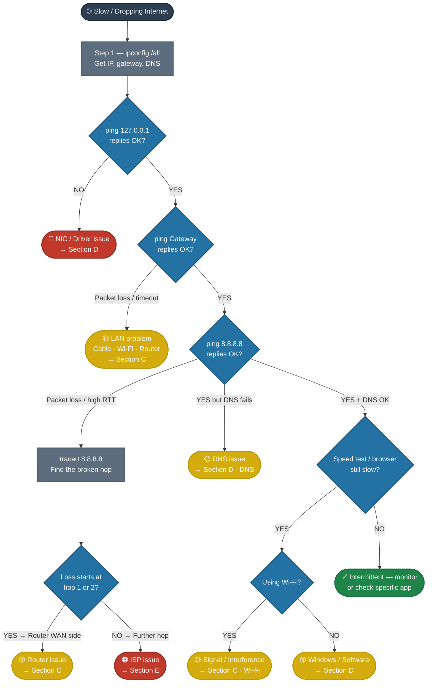

# Windows — Slow / Intermittently Dropping Internet

<div style="display:flex;gap:8px;flex-wrap:wrap;margin-bottom:16px">
<span style="background:#e67e22;color:white;padding:3px 12px;border-radius:12px;font-size:0.85em;font-weight:bold">MEDIUM SEVERITY</span>
<span style="background:#2ecc71;color:white;padding:3px 12px;border-radius:12px;font-size:0.85em;font-weight:bold">RESOLVED — 2026-03-30</span>
<span style="background:#3498db;color:white;padding:3px 12px;border-radius:12px;font-size:0.85em;font-weight:bold">Linux (Nobara) · Own Machine</span>
<span style="background:#7f8c8d;color:white;padding:3px 12px;border-radius:12px;font-size:0.85em;font-weight:bold">Internet required to verify</span>
</div>

---

## Fault Tree — Start Here



---

## ✅ Resolved Case — 2026-03-30

<div style="border-left:4px solid #2ecc71;padding:14px 16px;border-radius:0 8px 8px 0;margin:4px 0">

**Machine:** Nobara Linux · Wi-Fi only (`wlp1s0`) · Router in garage
**Symptom:** Slow, intermittent ("roping") internet connection

**Root cause:** Physical distance from the router causing Wi-Fi signal degradation. Signal averaged **-71 dBm** (threshold is -67 dBm), forcing the Wi-Fi chipset to throttle TX bitrate down to 28–45 Mbps and introducing severe jitter.

**Diagnostic path:**

**Step 1 — `ifconfig -a` → Interface health check**

<div style="border:2px solid #e74c3c;border-radius:8px;padding:12px;margin:8px 0">

| Interface | RX Errors | RX Dropped | TX Errors | TX Dropped | Verdict |
|---|---|---|---|---|---|
| `lo` (loopback) | 0 | 0 | 0 | 0 | ✅ Healthy |
| `wlp1s0` (Wi-Fi) | 0 | **3338** | 0 | **53** | 🔴 Struggling |

> **3338 dropped RX packets** with zero errors means the NIC and cable are physically fine, but the kernel is discarding packets it can't process fast enough — a classic overrun caused by a weak, fluctuating signal forcing constant retransmissions. This was the first red flag pointing to a link-layer problem, not a software one.

</div>

**Step 2 — `ip route show` → confirmed gateway `192.168.0.1`, single Wi-Fi interface, no Ethernet**

**Step 3 — `ping -c 20 192.168.0.1` from usual spot → unstable LAN link**

<div style="border:2px solid #e74c3c;border-radius:8px;padding:12px;margin:8px 0">

| Packet | RTT | Status |
|---|---|---|
| seq 1–5 | 3–4ms | ✅ Normal |
| **seq 6** | **126ms** | 🔴 Spike |
| **seq 7** | **60ms** | 🔴 Spike |
| **seq 8** | **100ms** | 🔴 Spike |
| seq 9–16 | 3–7ms | ✅ Normal |
| **seq 17–18** | **24–72ms** | 🔴 Spike |
| seq 19–20 | 3ms | ✅ Normal |

**Summary · Usual spot:**

| Metric | Value | Healthy Target | Verdict |
|---|---|---|---|
| Packet loss | 0% | 0% | ✅ |
| Avg RTT | 22.8ms | < 5ms | 🔴 5× over |
| Jitter (mdev) | 35.7ms | < 2ms | 🔴 18× over |
| Max spike | 126ms | < 10ms | 🔴 |

</div>

**Step 4 — `nmcli dev wifi list` → signal and channel analysis**

<div style="border:2px solid #f39c12;border-radius:8px;padding:12px;margin:8px 0">

| SSID | Band | Channel | Signal | Rate | Status |
|---|---|---|---|---|---|
| **home wifi** *(connected)* | 5GHz | 36 | **47–48%** | 1170 Mbit/s | ⚠️ Weak |
| home wifi | 2.4GHz | 6 | 50–54% | 130 Mbit/s | ⚠️ Marginally better |
| TEG-02S (neighbor) | 2.4GHz | 6 | 47–52% | — | ⚠️ Channel collision |
| Inverter-HV… (neighbor) | 2.4GHz | 1 | 55–57% | — | — |

> Connected to 5GHz (shorter range) while the router is in the garage — 5GHz was actively worsening the signal compared to 2.4GHz. Channel 6 on 2.4GHz is congested by neighbors but still more stable at this distance.

</div>

**Step 5 — `iw dev wlp1s0 link` + `station dump` → signal and bitrate details**

<div style="border:2px solid #e74c3c;border-radius:8px;padding:12px;margin:8px 0">

| Metric | Value | Healthy Target | Verdict |
|---|---|---|---|
| Signal strength | **-71 dBm** | > -67 dBm | 🔴 Below threshold |
| TX bitrate | **28–45 Mbps** | 300+ Mbps | 🔴 Throttled to ~10% |
| RX bitrate | **81–121 Mbps** | 300+ Mbps | ⚠️ Reduced |
| TX retries | 0 | 0 | ✅ |
| Beacon loss | 0 | 0 | ✅ |
| RX drop misc | 21 | 0 | ⚠️ Minor |

> TX much lower than RX is a classic weak signal pattern — the router can transmit louder, the client cannot. The chipset rate-adapts the TX speed downward to maintain the connection, causing the jitter spikes seen in the ping.

</div>

**Step 6 — `ping -c 20 192.168.0.1` near the router → router confirmed healthy**

<div style="border:2px solid #2ecc71;border-radius:8px;padding:12px;margin:8px 0">

| Metric | Value | Verdict |
|---|---|---|
| Packet loss | 0% | ✅ |
| Avg RTT | 4.659ms | ✅ |
| Jitter (mdev) | 1.815ms | ✅ |
| Max spike | 9.8ms | ✅ |

> Near-perfect results with no code changes — proves the router hardware is healthy and the ISP is not the issue. The problem is entirely the physical distance.

</div>

**Final comparison — distance is the only variable:**

<div style="border:2px solid #2ecc71;border-radius:8px;padding:12px;margin:8px 0;background:linear-gradient(135deg,rgba(231,76,60,0.08),rgba(46,204,113,0.08))">

| Location | Signal | TX Bitrate | Avg RTT | Jitter | Max Spike | Verdict |
|---|---|---|---|---|---|---|
| **Usual spot** | -71 dBm | 28–45 Mbps | 22.8ms | 35.7ms | 126ms | 🔴 Degraded |
| **Near router** | — | — | 4.659ms | 1.815ms | 9.8ms | ✅ Healthy |

</div>

**Solution:** Mesh network node placed centrally between the garage and the work area. Wired backhaul to the garage router preferred for best performance.

**Interim workaround (before mesh):** Force 2.4GHz band for better range at the cost of peak speed:
```bash
nmcli con modify "home wifi" 802-11-wireless.band bg
nmcli con up "home wifi"
```

**Note on 5GHz:** The machine was connected to the 5GHz band (channel 36, 1170 Mbit/s capable). 5GHz has shorter range — with the router in the garage this was actively making the signal worse. 2.4GHz would be more stable at this distance until a mesh node is deployed.

</div>

---

## 🔵 Phase 1 — Discover the Network Layout

> [!tip] Always start here — you need the IP, gateway, and DNS before you can run any other test

**Open Command Prompt as Administrator:**
`Win + R` → type `cmd` → `Ctrl+Shift+Enter`

**Run:**
```
ipconfig /all
```

<details>
<summary>📋 What to record from the output</summary>

Look for the **active adapter** — either "Ethernet adapter" or "Wireless LAN adapter Wi-Fi":

| Field | What It Tells You | Record It |
|---|---|---|
| `IPv4 Address` | Device's LAN IP | e.g. `192.168.1.45` |
| `Default Gateway` | Router's LAN IP — you will ping this | e.g. `192.168.1.1` |
| `DNS Servers` | Where names resolve | e.g. `8.8.8.8` or `192.168.1.1` |
| `DHCP Enabled` | `Yes` = router assigns IP · `No` = manually set | |
| `Physical Address` | MAC address — useful for router logs | |
| `Link-local IPv6` | Ignore unless ISP is IPv6-only | |

> [!warning] If `Default Gateway` is blank or `0.0.0.0`
> The device has no route out — it cannot reach the router at all. Jump to [[#🟡 Phase 3 — LAN and Router]] immediately.

> [!warning] If `IPv4 Address` starts with `169.254.x.x`
> This is an APIPA address — the machine failed to get a DHCP lease from the router. The device can't talk to anything outside itself. Jump to [[#🟡 Phase 3 — LAN and Router]].

</details>

---

## 🔵 Phase 2 — Isolate the Device

> [!tip] These two pings tell you whether the problem is on the machine itself or somewhere outside it

### Step 1 — Ping Localhost (Test the NIC and TCP/IP Stack)

```
ping 127.0.0.1 -n 10
```

<div style="display:grid;grid-template-columns:1fr 1fr;gap:10px;margin:12px 0">

<div style="border:2px solid #2ecc71;border-radius:8px;padding:12px">
<b>✅ All 10 replies, ~0ms</b><br>
The NIC and Windows TCP/IP stack are healthy.<br>
→ Continue to Step 2
</div>

<div style="border:2px solid #e74c3c;border-radius:8px;padding:12px">
<b>🔴 Request timed out / General failure</b><br>
The TCP/IP stack itself is broken — the machine can't even talk to itself.<br>
→ Jump to <a href="#🔴-phase-4--windows-network-stack">Section D — Stack Repair</a>
</div>

</div>

---

### Step 2 — Ping the Default Gateway (Test LAN Link to Router)

Use the gateway IP you recorded from `ipconfig /all`:

```
ping <gateway-ip> -n 20
```

Example: `ping 192.168.1.1 -n 20`

> [!info] Why 20 packets?
> A short burst might look clean even on a flaky link. 20 packets gives you a statistically meaningful loss percentage.

<div style="display:grid;grid-template-columns:1fr 1fr 1fr;gap:10px;margin:12px 0">

<div style="border:2px solid #2ecc71;border-radius:8px;padding:12px">
<b>✅ 0% loss, RTT &lt; 5ms</b><br>
LAN link and router are solid.<br>
→ Continue to Phase 3
</div>

<div style="border:2px solid #f39c12;border-radius:8px;padding:12px">
<b>⚠️ Some loss or RTT &gt; 50ms</b><br>
Unstable LAN connection.<br>
• Wi-Fi: weak signal or interference → <a href="#wi-fi-specific">Wi-Fi section</a><br>
• Ethernet: try a different cable or port
</div>

<div style="border:2px solid #e74c3c;border-radius:8px;padding:12px">
<b>🔴 100% timeout</b><br>
Cannot reach the router at all.<br>
→ Jump to <a href="#🟡-phase-3--lan-and-router">Section C</a>
</div>

</div>

---

## 🟠 Phase 3 — Test the WAN (Router to Internet)

> [!tip] Gateway pings are clean → the LAN is healthy. Now test if the router can reach the internet.

### Step 3 — Ping a Public IP

```
ping 8.8.8.8 -n 20
```

<div style="display:grid;grid-template-columns:1fr 1fr 1fr;gap:10px;margin:12px 0">

<div style="border:2px solid #2ecc71;border-radius:8px;padding:12px">
<b>✅ Clean replies</b><br>
IP routing is working. If the browser is slow, it may be DNS.<br>
→ Test DNS: <code>ping google.com -n 5</code><br>
→ If that fails: <a href="#dns-issue">DNS section</a><br>
→ If that works: <a href="#🟡-phase-4--windows-network-stack">Section D</a>
</div>

<div style="border:2px solid #f39c12;border-radius:8px;padding:12px">
<b>⚠️ Packet loss or high RTT</b><br>
Problem is somewhere between the router and the internet.<br>
→ Run tracert to pinpoint the hop
</div>

<div style="border:2px solid #e74c3c;border-radius:8px;padding:12px">
<b>🔴 100% timeout</b><br>
Router cannot reach the internet — or ISP is blocking ICMP.<br>
→ Also try: <code>ping 1.1.1.1 -n 10</code><br>
→ If both fail → ISP or router WAN issue
</div>

</div>

---

### Step 4 — Trace the Route (Find the Broken Hop)

Run **both** — `tracert` shows hops, `pathping` shows per-hop loss statistics:

```
tracert 8.8.8.8
```

```
pathping 8.8.8.8
```

> [!info] `pathping` takes ~5 minutes to complete — it's more accurate than tracert for intermittent drops

<details>
<summary>📋 How to read the output</summary>

**tracert output example:**
```
  1    1 ms    1 ms    1 ms  192.168.1.1        ← your router (gateway)
  2   12 ms   11 ms   12 ms  10.0.0.1           ← ISP first hop
  3    *        *        *   Request timed out   ← common — ISP drops ICMP, not a problem
  4   18 ms   19 ms   17 ms  72.14.192.1        ← Google's network
  5   20 ms   20 ms   20 ms  8.8.8.8            ← destination
```

**Interpreting loss:**

| Where Loss Appears | Meaning |
|---|---|
| Hop 1 (your gateway) | Router or LAN problem → [[#🟡 Phase 3 — LAN and Router]] |
| Hop 2 (ISP first hop) | ISP's equipment or your modem → [[#🟠 Phase 5 — ISP Escalation]] |
| A middle hop only | That router drops ICMP pings — usually normal, not the real problem |
| All hops from point X onward | True break at hop X |
| `* * *` everywhere | ICMP blocked entirely — not conclusive |

> [!warning] A single hop showing `* * *` in the middle does not mean that's where it's broken. Loss must persist from that hop **all the way to the destination** to indicate a real problem.

</details>

---

## 🟡 Phase 3 — LAN and Router

> [!note] You land here if the gateway ping failed or tracert loss starts at hop 1

### Cable Check (Ethernet)

<div style="display:grid;grid-template-columns:1fr 1fr;gap:10px;margin:12px 0">

<div style="border:1px solid #3498db;border-radius:8px;padding:12px">
<b>🔌 Physical checks</b><br>
• Ethernet cable clicked in firmly at both ends<br>
• Try a different cable<br>
• Try a different port on the router/switch<br>
• Check for bent pins in the RJ45 port<br>
• Look for the link light on the NIC (should be solid or blinking green)
</div>

<div style="border:1px solid #e74c3c;border-radius:8px;padding:12px">
<b>⚠️ Link light off</b><br>
No physical link established.<br>
• Bad cable or port — swap first<br>
• If still dead: NIC may have failed → <a href="#🔴-phase-4--windows-network-stack">Section D</a>
</div>

</div>

---

### Wi-Fi Specific

<details>
<summary>Wi-Fi signal and interference checks</summary>

**Check signal strength (CMD):**
```
netsh wlan show interfaces
```
Look for `Signal` — values below 60% are problematic.

**Check available networks and channels:**
```
netsh wlan show networks mode=bssid
```

**Common interference sources:**
- Microwave ovens (2.4 GHz band)
- Neighboring routers on the same channel
- Bluetooth devices (2.4 GHz overlap)
- Thick walls, metal objects, distance

**What to try:**
- Move closer to the router
- Switch the router channel in its admin panel (try channels 1, 6, or 11 for 2.4 GHz; auto for 5 GHz)
- Connect to 5 GHz band if available — faster, less interference, but shorter range
- Test with an Ethernet cable to confirm if Wi-Fi is the variable

</details>

---

### Router Diagnostics

<details>
<summary>Access the router admin panel</summary>

Open a browser and navigate to your gateway IP (from `ipconfig /all`):
- Common addresses: `192.168.1.1` · `192.168.0.1` · `10.0.0.1`
- Default credentials are often printed on a label on the router

**What to check:**

| Section | What to Look For |
|---|---|
| WAN / Internet Status | Should show "Connected" with a public IP assigned |
| Connection Type | PPPoE / DHCP / Static — must match ISP requirements |
| Signal Levels (if cable modem) | See below for acceptable ranges |
| Error Counters | Uncorrectable errors, T3/T4 timeouts — any non-zero is a red flag |
| Connected Devices | Confirm the client machine appears in the list |
| Uptime | Very short uptime (minutes) = router is rebooting itself — possible hardware fault |

**Cable modem signal levels (DOCSIS):**

| Metric | Good Range | Problem |
|---|---|---|
| Downstream Power | -7 to +7 dBmV | Outside range → signal issue |
| Downstream SNR | > 30 dB | Below 25 dB → errors and drops |
| Upstream Power | 38–48 dBmV | > 51 dBmV → amplifier maxed, ISP problem |

**Reboot sequence (always do this before calling ISP):**
1. Power off the modem (unplug power — not just reboot button)
2. Wait 30 seconds
3. Power on the modem — wait until all lights stabilize (~60–90s)
4. Power on the router
5. Wait 2 minutes, then retest

</details>

> [!question] Router looks healthy and rebooting didn't fix it? → [[#🟠 Phase 5 — ISP Escalation]]

---

## 🔴 Phase 4 — Windows Network Stack

> [!note] Land here if: localhost ping failed · driver issue · DHCP not working · DNS failing

### DNS Issue

<details>
<summary>Test and fix DNS</summary>

**Test if DNS is the problem:**
```
ping 8.8.8.8 -n 5
ping google.com -n 5
```
If the IP ping works but the name ping fails → DNS is broken.

**Flush DNS cache:**
```
ipconfig /flushdns
```

**Switch to a public DNS server:**
`Control Panel` → `Network and Internet` → `Network Connections` → right-click adapter → `Properties` → `Internet Protocol Version 4` → `Use the following DNS server addresses`:
- Preferred: `8.8.8.8` (Google)
- Alternate: `1.1.1.1` (Cloudflare)

</details>

---

### Release and Renew DHCP

<details>
<summary>Force a fresh IP assignment from the router</summary>

```
ipconfig /release
ipconfig /renew
ipconfig /all
```

Confirm the new IP is a valid LAN address (not 169.254.x.x). If it returns APIPA again, the router is not responding to DHCP requests — likely a router issue.

</details>

---

### Reset the Network Stack (TCP/IP and Winsock)

> [!warning] This requires a reboot. Do this only after the above steps haven't helped.

```
netsh winsock reset
netsh int ip reset
ipconfig /flushdns
ipconfig /registerdns
```

Reboot after running all four.

---

### NIC Driver Issue

<details>
<summary>Check and fix the NIC driver</summary>

**Check Device Manager for errors:**
`Win + X` → `Device Manager` → expand `Network Adapters`

Look for:
- Yellow exclamation mark → driver error
- Red X → device disabled
- Missing adapter entirely → driver not installed

**Disable and re-enable the adapter:**
Right-click the NIC → Disable → wait 5s → Enable

**Update or roll back the driver:**
Right-click the NIC → Properties → Driver tab:
- `Update Driver` → "Search automatically" first
- If problem started after a Windows Update: `Roll Back Driver`

**Uninstall and reinstall:**
Right-click → Uninstall device → check "Delete the driver software" → reboot. Windows will reinstall the default driver.

> [!info] On laptops: also check Wi-Fi adapter separately from Ethernet NIC. They are separate entries in Device Manager.

</details>

---

### Windows Built-in Network Troubleshooter

> [!tip] Not always conclusive — but can auto-fix DHCP and DNS issues quickly

```
Settings → System → Troubleshoot → Other troubleshooters → Internet Connections → Run
```

Or from CMD:
```
msdt.exe /id NetworkDiagnosticsNetworkAdapter
```

---

### Full TCP/IP Stack Repair (Advanced)

<details>
<summary>SFC and DISM for corrupted network components</summary>

Run CMD as Administrator:

```
sfc /scannow
```

If it reports "could not fix":
```
DISM /Online /Cleanup-Image /RestoreHealth
```

Then run SFC again after DISM completes.

If network stack is severely corrupt and nothing else works:
```
netsh int tcp set global autotuninglevel=normal
netsh int tcp set global chimney=disabled
netsh int tcp set global rss=enabled
```

</details>

---

## 🟠 Phase 5 — ISP Escalation

> [!note] Reach here if: loss starts at hop 2 in tracert · router WAN status shows errors · all device/router steps pass

### Build Your Case Before Calling

Collect this before you dial:

<details>
<summary>📋 Information to gather</summary>

Run all of these and save the output (copy-paste to Notepad):

```
ipconfig /all
ping 8.8.8.8 -n 50
pathping 8.8.8.8
tracert 8.8.8.8
```

Also note:
- Router modem signal levels (downstream power, SNR, upstream power)
- Exact times when drops occurred
- Whether the issue is constant or intermittent (and the pattern if intermittent)
- How long the problem has been happening
- Whether any neighbors on the same ISP are also affected

</details>

### What to Tell the ISP

<div style="border-left:4px solid #e74c3c;padding:14px 16px;border-radius:0 8px 8px 0;margin:4px 0">

Tell them:
1. "I have isolated the issue to the WAN side — my router and all local devices pass local diagnostics."
2. Provide the `tracert` output — specifically which hop shows loss.
3. Provide modem signal levels if available — this prevents them from sending you in circles.
4. Request a **line test** from their end and ask them to check for **noise** or **signal degradation** on your line.
5. Ask specifically: "Is there an outage or maintenance in my area?"

> [!warning] ISPs will often ask you to reboot your router as a first step. Do this before calling to save time — and tell them you already did it and when.

</div>

---

## 📋 Quick Command Reference

```
ipconfig /all                          show full network config, IP, gateway, DNS
ipconfig /release                      drop the current DHCP lease
ipconfig /renew                        request a new IP from the router
ipconfig /flushdns                     clear DNS cache
ping 127.0.0.1 -n 10                   test local NIC / TCP stack
ping <gateway> -n 20                   test LAN link to router
ping 8.8.8.8 -n 20                     test WAN routing to internet
ping google.com -n 5                   test DNS resolution
tracert 8.8.8.8                        trace route to internet, find broken hop
pathping 8.8.8.8                       trace route + per-hop packet loss stats
netsh wlan show interfaces             Wi-Fi signal strength and status
netsh wlan show networks mode=bssid    available SSIDs with channels
netsh winsock reset                    reset Winsock (needs reboot)
netsh int ip reset                     reset TCP/IP stack (needs reboot)
netsh int tcp set global autotuninglevel=normal   restore TCP auto-tuning
sfc /scannow                           system file integrity check
DISM /Online /Cleanup-Image /RestoreHealth        repair Windows image
msdt.exe /id NetworkDiagnosticsNetworkAdapter     run network troubleshooter
devmgmt.msc                            Device Manager
ncpa.cpl                               Network Connections (adapter properties)
```

---

## 📋 Decision Table

| Test Result | Conclusion | Action |
|---|---|---|
| `ping 127.0.0.1` fails | Windows TCP/IP stack broken | [[#🔴 Phase 4 — Windows Network Stack]] |
| IPv4 shows `169.254.x.x` | No DHCP lease from router | Check router, run `ipconfig /release` + `/renew` |
| Gateway ping fails (100%) | No LAN connectivity | Check cable, Wi-Fi signal, router reboot |
| Gateway ping partial loss | Unstable LAN | Swap cable · move closer to router · change channel |
| `ping 8.8.8.8` fails, gateway OK | Router WAN issue or ISP | Router admin panel → if clean → ISP |
| Tracert loss at hop 1 | Router problem | Router diagnostics, reboot |
| Tracert loss at hop 2+ | ISP problem | Collect evidence → call ISP |
| All pings OK, browser slow | DNS or per-app issue | Flush DNS, test with 8.8.8.8 as DNS |
| All pings OK, speed test slow | Bandwidth / ISP throttle | Call ISP, test different time of day |
| Wi-Fi signal &lt; 60% | Weak signal | Move closer, change channel, check for interference |
