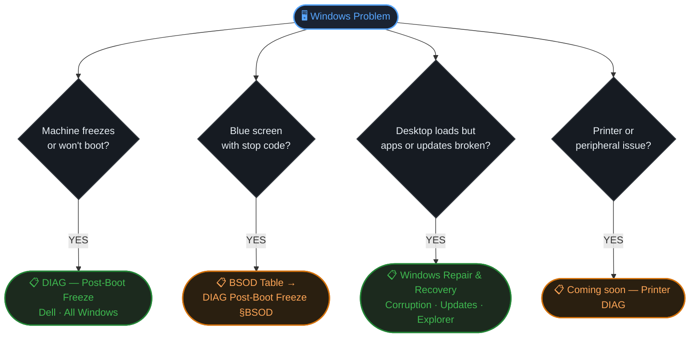

 <!-- HERO --> 
 
⬡ Knowledge Hub · IT Support
 
Windows Incident Index
 
Triage → Diagnostic Guide → Incident Report → Resolution
 
 ◈ Platform: Windows 10 / 11 ◈ Scope: Field Support · Enterprise ◈ Tools: CMD · WinRE · Medicat USB ◈ Format: DIAG · Incident Reports 
 
 <!-- HOW TO USE --> 
 
How to use this index
 
 
DIAG files — Reusable diagnostic playbooks. Start here when a new ticket matches a known symptom pattern.
 
Incident Reports — One file per resolved case. Link a report back to the DIAG file it followed.
 
 
 

---

## ⚡ Quick Triage — Start Here

---

## 📋 Diagnostic Playbooks

> [!tip] One DIAG file per **symptom category** — not per machine or case. Each DIAG file is a reusable fault tree with escalation paths.

 
 
FREEZE · CRASH · NO BOOT
 
Post-Boot Freeze
 
Freeze ~60s after boot. Covers ePSA, Safe Mode, WinRE offline logs, MemTest86, driver isolation, OS repair escalation. Includes BSOD stop code table.
 
 High Severity Dell · All Windows No internet required 
 
→ [[DIAG_dell_post_boot_freeze]]
 
 
 
CORRUPTION · UPDATES · DESKTOP
 
Windows Repair & Recovery
 
Desktop not loading, update failures, corrupted system files. Covers SFC → DISM pipeline, update cache flush, explorer.exe recovery. Event IDs 41 and 6008.
 
 Resolved All Windows Internet optional 
 
→ [[Windows_Incident_Management]]
 
 
 
DRIVER · DEVICE
 
Printer & Peripheral Failures
 
Spooler corruption, USB not detected, driver rollback. Brother, Canon, Konica Minolta. Coming soon.
 
→ [[DIAG_printer_peripheral]] · not yet created
 
 
 
NETWORK · CONNECTIVITY
 
Network & DNS Failures
 
No internet, adapter reset, DNS flush, TP-Link / DSL modem diagnostics. Coming soon.
 
→ [[DIAG_network_connectivity]] · not yet created
 
 

---

## 🗂️ Incident Reports

> [!info] Each row = one resolved case. Severity, root cause, and DIAG file used — quick scan before opening the full report.

|Date|Severity|Machine|Symptom|Root Cause|DIAG Used|Report|
|---|---|---|---|---|---|---|
|2026-03-25|🟡 Med|Dell DESKTOP-HTVN0BQ|Freeze ~60s after boot|FS corruption + corrupted `MicrosoftEdgeElevationService`|[[DIAG_dell_post_boot_freeze]]|[[INC_2026-03-25_dell_freeze]]|
|2026-03-30|🔴 High|Dell DESKTOP-HTVN0BQ|Hard freeze before login — WinRE only|Corrupted `TrustedInstaller` / Windows Modules Installer|[[DIAG_dell_post_boot_freeze]]|[[INC_2026-03-30_dell_freeze_recurrence]]|
|—|🟡 Med|Windows PC (client)|Desktop not loading after shutdown|Corrupted update cache + dirty shutdowns (Event ID 41 / 6008)|[[Windows_Incident_Management]]|[[Windows_Incident_Management]]|

> [!tip] Naming convention for new reports: `INC_YYYY-MM-DD_short_description.md`

---

## 🔑 Repair Command Cheatsheet

 
Quick Reference — CMD as Administrator
 
 
 
FILE SYSTEM
 
chkdsk C: /f /r sfc /scannow DISM /Online /Cleanup-Image /RestoreHealth
 
 
 
UPDATE CACHE FLUSH
 
net stop wuauserv bits cryptsvc msiserver rd /s /q C:\Windows\SoftwareDistribution net start wuauserv bits cryptsvc msiserver
 
 
 
SAFE MODE / BOOT
 
bcdedit /set {default} safeboot minimal bcdedit /deletevalue {default} safeboot bcdedit /set {default} bootlog yes
 
 
 
OFFLINE LOGS (WinRE)
 
wevtutil qe /lf:true C:\Windows\...\System.evtx /q:"*[System[(Level=1 or Level=2)]]" /c:20 /rd:true /f:text
 
 
 

---

## 🔴 BSOD Stop Code Index

|Stop Code|Likely Cause|Go To|
|---|---|---|
|`PAGE_FAULT_IN_NONPAGED_AREA`|Bad RAM or faulty driver|[[DIAG_dell_post_boot_freeze#B2 — RAM]] · [[DIAG_dell_post_boot_freeze#D — Drivers]]|
|`WHEA_UNCORRECTABLE_ERROR`|CPU, RAM, or motherboard|[[DIAG_dell_post_boot_freeze#B2 — RAM]] · [[DIAG_dell_post_boot_freeze#B6 — CPU & Motherboard]]|
|`MEMORY_MANAGEMENT`|Direct RAM failure|[[DIAG_dell_post_boot_freeze#B2 — RAM]]|
|`KERNEL_DATA_INPAGE_ERROR`|RAM or storage|[[DIAG_dell_post_boot_freeze#B2 — RAM]] · [[DIAG_dell_post_boot_freeze#B3 — Storage]]|
|`CRITICAL_PROCESS_DIED`|OS corruption or disk failure|[[DIAG_dell_post_boot_freeze#E — Software & Malware]] · [[DIAG_dell_post_boot_freeze#F — OS Repair]]|
|`IRQL_NOT_LESS_OR_EQUAL`|Faulty driver|[[DIAG_dell_post_boot_freeze#D — Drivers]]|
|`SYSTEM_SERVICE_EXCEPTION`|Corrupt driver or system file|[[DIAG_dell_post_boot_freeze#D — Drivers]]|
|`DPC_WATCHDOG_VIOLATION`|Storage or NIC driver|[[DIAG_dell_post_boot_freeze#D — Drivers]] · [[DIAG_dell_post_boot_freeze#B3 — Storage]]|
|`VIDEO_TDR_FAILURE`|GPU driver or hardware|[[DIAG_dell_post_boot_freeze#B5 — GPU]]|
|`NTFS_FILE_SYSTEM`|Disk / filesystem corruption|[[DIAG_dell_post_boot_freeze#B3 — Storage]]|

---

## 🧰 Tools at a Glance

|Tool|Purpose|Access|Internet|
|---|---|---|---|
|**Dell ePSA / SupportAssist**|Tests CPU, RAM, disk, fans|F12 → Diagnostics|No|
|**MemTest86**|Thorough multi-pass RAM test|Medicat USB|No|
|**CrystalDiskInfo**|SMART drive health|Medicat → Hiren's PE|No|
|**HWiNFO64**|Temps, voltages, sensors|Medicat → Hiren's PE|No|
|**Windows Memory Diagnostic**|Basic RAM check|`mdsched.exe`|No|
|**SFC**|Repairs Windows protected files|CMD (Admin)|No|
|**DISM**|Repairs Windows component store|CMD (Admin)|Offline: No|
|**Event Viewer**|System error and crash logs|`eventvwr.msc`|No|
|**Malwarebytes Portable**|Malware scan|Medicat → Hiren's PE|No|

---

 
Windows Incident Index · IT Support KB
 
 2 DIAG files active 3 incidents logged 2 DIAG files pending 
 
